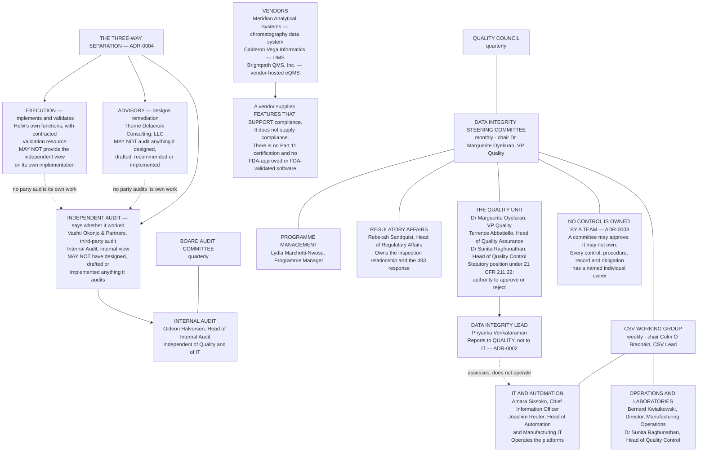

# Diagram — Governance, and the Three-Way Separation

| Field | Value |
|---|---|
| Version | 1.0 |
| Date | 2026-05-29 |
| Owner | Dr Marguerite Oyelaran, Vice President, Quality |
| Approver | Gideon Halvorsen, Head of Internal Audit |
| Classification | Confidential — Helix Pharma, Inc. Data Integrity Programme // Illustrative Portfolio Sample |

*Phase 01 speaks as at **2026-05-29**. Helix Pharma, its people, its governance bodies and its external
parties are fictional and illustrative. `21 CFR 211.22` and the other citations shown are real. The
governance structure, the twelve roles and the cadences are owned by `01.07`; this diagram draws them.*

---

**Three separations are drawn here and each does different work.**

**The Data Integrity Lead reports to Quality and not to IT.** The role assesses the adequacy of controls
over systems that the IT and Automation organisation builds and operates, and a data integrity function
inside the organisation that operates the systems is assessing its own work. The dotted edge marks the
relationship the arrangement is designed to keep honest: the Data Integrity Lead works with IT daily and
holds no line authority over it. `ADR-0002`, argued at `01.07 §3`.

**Advisory, execution and independent audit are three different parties, and no party audits its own
work.** Thorne Delacroix Consulting designs remediation and may not audit it. Vashti Okonjo &amp;
Partners audits and may not have designed anything it audits. Internal audit's independence is
structural — the Head of Internal Audit reports to the Board's audit committee, outside both Quality and
IT. `ADR-0004`.

**Internal audit is deliberately outside the programme, not above it.** It is not shown reporting into
the Data Integrity Steering Committee, because a function whose opinion the programme needs cannot sit
inside the programme's governance. The Board audit committee is where its reporting goes.

**The quality unit's position is statutory, and the diagram shows it as such.** `21 CFR 211.22` gives
the quality unit the authority to approve or reject, and `21 CFR 211.192` requires it to review and
approve production and control records. That authority is the reason the Data Integrity Lead sits where
it does.

**A committee may approve; it may not own.** Four governance bodies appear here — the Data Integrity
Steering Committee monthly, the CSV Working Group weekly, the Quality Council quarterly and the Board
audit committee quarterly. None of them owns a control. `ADR-0008`.

**Nothing in this structure has produced an assurance outcome.** At the vantage of **2026-05-29** **no
third-party audit has occurred, no internal audit of the remediated programme has occurred, and no
finding of any kind has been raised under this programme.** The diagram draws the arrangement, and
states nothing about what any audit will find.

## Cross-References

| Document | Relationship |
|---|---|
| [01.07 Roles, Governance and the Quality Unit](../01.07-roles-governance-and-the-quality-unit.md) | Owns the structure, the twelve roles, the cadences and the quality unit's position |
| [01.06 The Programme Charter](../01.06-the-programme-charter.md) | The objectives the governance bodies steer |
| [adr/ADR-0002 The Data Integrity Lead Reports to Quality](../adr/ADR-0002-the-data-integrity-lead-reports-to-quality.md) | The first separation |
| [adr/ADR-0004 Three-Way Separation of Advisory, Execution and Audit](../adr/ADR-0004-three-way-separation-of-advisory-execution-and-audit.md) | The second separation |
| [adr/ADR-0008 No Control Is Owned by a Team](../adr/ADR-0008-no-control-is-owned-by-a-team.md) | The ownership rule |
| [01.09 The Four Audits That Found Nothing](../01.09-the-four-audits-that-found-nothing.md) | Internal audit's history, and `IS-01` |

← [diagrams/01-what-part-11-reaches.md](01-what-part-11-reaches.md) · [Phase 01 README](../01.00-README.md) · [diagrams/01-the-programme-timeline.md](01-the-programme-timeline.md) →
