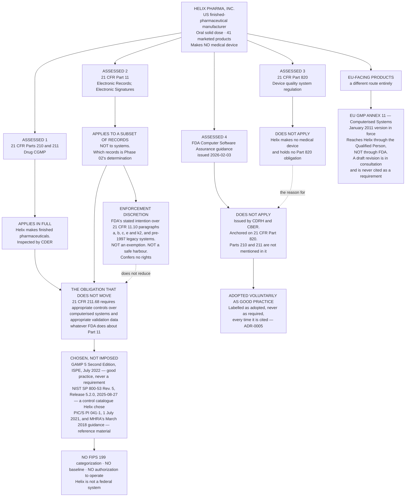

# Diagram — The Four Instruments Assessed, and the Two That Do Not Apply

| Field | Value |
|---|---|
| Version | 1.0 |
| Date | 2026-05-29 |
| Owner | Rebekah Sandquist, Head of Regulatory Affairs |
| Approver | Amara Sissoko, Chief Information Officer |
| Classification | Confidential — Helix Pharma, Inc. Data Integrity Programme // Illustrative Portfolio Sample |

*Phase 01 speaks as at **2026-05-29**. Helix Pharma is fictional and illustrative. The instruments
shown, their issuing bodies, their versions and their scope are real and are cited at `01.03`, `01.04`
and `01.05`.*

---

**Four assessed. Two apply. Two do not.** That is the substance of this phase, and the two that do not
apply are the harder half to get right.

**The dotted edge between `A3` and `A4` carries the whole argument.** FDA's Computer Software Assurance
guidance does not apply to Helix **because** 21 CFR Part 820 does not apply to Helix. The guidance is
issued by CDRH and CBER, its regulatory anchor is Part 820 with ISO 13485:2016 incorporated by
reference, and its scope sentence is qualified *"for medical devices"* throughout. **21 CFR Parts 210
and 211 are not mentioned anywhere in it.** Its current version, issued 2026-02-03, supersedes the
version issued 2025-09-24 and supersedes **Section 6 only** of the 2002 *General Principles of Software
Validation*. `01.05 §4` owns that determination.

**The right-hand branch is the honest half.** Helix adopts CSA's risk-based assurance thinking
voluntarily, as good practice, and labels it as adopted rather than required every single time it is
cited — `ADR-0005`. Nothing in this programme is justified by it.

**The second dotted edge is the one a reader should linger on.** Enforcement discretion runs from FDA's
August 2003 Scope and Application guidance, which remains current, final and in force. It is a **stated
intention**, marked *Contains Nonbinding Recommendations*, conferring no rights and amending no
regulation — and it does not reduce the obligation at `21 CFR 211.68`, which is a regulation and which
FDA has announced no discretion over. `01.04 §3` owns that argument. **A programme that reads
enforcement discretion as permission has read the wrong document.**

**The Annex 11 branch leaves the FDA frame entirely.** It reaches the EU-facing products through the
marketing authorisation and the Qualified Person, and not through FDA. Only the **January 2011** version
is in force.

**Nothing in the lower half of this diagram has been applied to anything.** At the vantage of
**2026-05-29** there is no system inventory, no Part 11 applicability determination for any record
class, no risk assessment and no validation. The diagram draws the determination, not a state of
compliance, and it makes no claim that Helix meets or fails any requirement shown.

## Cross-References

| Document | Relationship |
|---|---|
| [01.05 What Does Not Apply](../01.05-what-does-not-apply.md) | Owns the determination this diagram draws |
| [01.03 What Part 11 Actually Is](../01.03-what-part-11-actually-is.md) | The `Q2` branch — records, not systems |
| [01.04 The Predicate Rules and Enforcement Discretion](../01.04-the-predicate-rules-and-enforcement-discretion.md) | The `HOOK` and `DISC` nodes |
| [adr/ADR-0005 The CSA Guidance Is Adopted Voluntarily](../adr/ADR-0005-the-csa-guidance-is-adopted-voluntarily.md) | The `VOL` node |
| [adr/ADR-0003 Enforcement Discretion Is Recorded, Not Relied On](../adr/ADR-0003-enforcement-discretion-is-recorded-not-relied-on.md) | The dotted edge into `HOOK` |
| [logs/regulatory-register.md](../logs/regulatory-register.md) | `O1` to `O12`, arising from the instruments that apply |

← [01.05 What Does Not Apply](../01.05-what-does-not-apply.md) · [Phase 01 README](../01.00-README.md) · [diagrams/01-what-part-11-reaches.md](01-what-part-11-reaches.md) →
