# Diagram — The Programme Timeline, from the Inspection to Close-Out

| Field | Value |
|---|---|
| Version | 1.0 |
| Date | 2026-05-29 |
| Owner | Lydia Marchetti-Nwosu, Programme Manager |
| Approver | Dr Marguerite Oyelaran, Vice President, Quality |
| Classification | Confidential — Helix Pharma, Inc. Data Integrity Programme // Illustrative Portfolio Sample |

*Phase 01 speaks as at **2026-05-29**. Helix Pharma, the inspection, the programme and every date after
the vantage are fictional and illustrative. Everything to the right of the vantage line is **planned**
and no part of it is an outcome.*

---

```mermaid
flowchart LR
    E1["2026-02-02<br/>FDA routine CGMP surveillance<br/>inspection OPENS at Ridgemont"]
    E2["2026-02-13<br/>Inspection CLOSES · twelve calendar days<br/>FORM FDA 483 issued<br/>7 observations · 3 concern electronic records"]
    E3["2026-03-02<br/>PROGRAMME KICKOFF<br/>seventeen days after the 483"]
    E4["2026-03-06<br/>WRITTEN RESPONSE FILED<br/>twenty-one days after issue"]
    E5["2026-05-29<br/>THE VANTAGE<br/>eighty-eight days after kickoff<br/>Phase 01 published"]
    E6["2027-04-30<br/>PROGRAMME CLOSE-OUT<br/>424 days from kickoff"]

    E1 --> E2 --> E3 --> E4 --> E5 --> E6

    E2 -. "the event this repository dates from" .-> OBS["OBS-2 · audit trail review in the QC laboratory<br/>OBS-4 · attribution of entries on a packaging line system<br/>OBS-6 · change to an approved value in the electronic batch record<br/>OBS-1, OBS-3, OBS-5, OBS-7 · outside this programme's scope"]

    E5 --> LINE["EVERYTHING BELOW AND TO THE RIGHT IS PLANNED.<br/>None of it has happened"]

    LINE --> P1["PHASE 01 — Programme foundation and regulatory scoping<br/>COMPLETE at the vantage"]
    P1 --> P2["PHASE 02 — The system inventory and Part 11 applicability"]
    P2 --> P3["PHASE 03 — Data integrity risk assessment and the ALCOA attributes"]
    P3 --> P4["PHASE 04 — The validation framework and policy architecture"]
    P4 --> P5["PHASE 05 — Access, audit trails and electronic signatures"]
    P5 --> P6["PHASE 06 — The chromatography data system"]
    P6 --> P7["PHASE 07 — The data lifecycle: backup, archive and the paper question"]
    P7 --> P8["PHASE 08 — Periodic review, internal audit and the 483 response"]
    P8 --> P9["PHASE 09 — Inspection readiness and continuous compliance"]
    P9 --> E6

    OPEN["THE OPEN QUESTION AT THE VANTAGE — IS-02<br/>Which records actually are Part 11 records,<br/>and did anybody ever write that down?<br/>Phase 02 asks it.<br/>IS-01 — why four audits raised nothing — waits for Phase 08"]
    E5 --> OPEN
```

**The programme dates from an event it did not choose.** FDA conducted a routine CGMP surveillance
inspection of the Ridgemont site over twelve calendar days and issued a Form FDA 483 at the close. **A
Form FDA 483 is not a legal finding** — *"The FDA Form 483 does not constitute a final Agency
determination of whether any condition is in violation of the FD&amp;C Act or any of its relevant
regulations."* `01.02 §2` owns that, and nothing in this repository characterises the inspection as a
violation of anything.

**The three intervals on the left are the ones worth reading.** Twelve days of inspection. Seventeen
days from the 483 to a funded programme with a charter. Twenty-one days from the 483 to a written
response addressing all seven observations. Helix has additionally committed, as **its own procedural
undertaking and not as a rule FDA imposes**, to responding in writing within fifteen business days of
any future observation.

**The vantage line is the most important element on this chart.** Everything to the left of
**2026-05-29** has happened and is reported in the past tense. Everything to the right is planned, and
Phase 01 says nothing whatever about its content.

Specifically, at the vantage: **no system inventory · no Part 11 applicability determination for any
record class · no data integrity risk assessment and no ALCOA assessment · no validation framework and
nothing validated · no control implementation, no audit trail configuration and no electronic signature
deployment · no periodic review · no internal audit of the remediated programme · no third-party audit ·
no further inspection and no inspection outcome of any kind.**

**And no forecast of one.** This programme does not predict what a future inspection will find, does not
carry an inspection outcome as an objective or a milestone, and reports an inspection outcome only once
it has occurred. `01.10 §6` states that refusal and holds it.

**The open question at the vantage — `IS-02`: which records actually are Part 11 records, and did anybody
ever write that down? Phase 02 asks it. `IS-01` — why four audits raised nothing — waits for Phase 08.**
The two are never conflated and never share an identifier.

## Cross-References

| Document | Relationship |
|---|---|
| [01.02 The Inspection and the Form FDA 483](../01.02-the-inspection-and-the-form-483.md) | The inspection, the 483 and the response on the left of this chart |
| [01.10 What This Programme Will and Will Not Do](../01.10-what-this-programme-will-and-will-not-do.md) | The nine phases and the standing refusal to forecast |
| [01.06 The Programme Charter](../01.06-the-programme-charter.md) | The schedule, the resourcing and the money behind the dates |
| [01.11 The Programme Calendar](../01.11-the-programme-calendar.md) | `CAL-01` to `CAL-12` and the milestones |
| [01.13 Phase Summary and Transition](../01.13-phase-summary-and-transition.md) | `IS-02`, `IS-01` and the handover to Phase 02 |
| [adr/ADR-0006 The 483 Observations Keep the 483's Numbering](../adr/ADR-0006-the-483-observations-keep-the-483s-numbering.md) | Why `OBS-2`, `OBS-4` and `OBS-6` are not renumbered |

← [diagrams/01-governance-and-the-three-way-separation.md](01-governance-and-the-three-way-separation.md) · [Phase 01 README](../01.00-README.md) · [01.02 The Inspection and the Form FDA 483](../01.02-the-inspection-and-the-form-483.md) →
