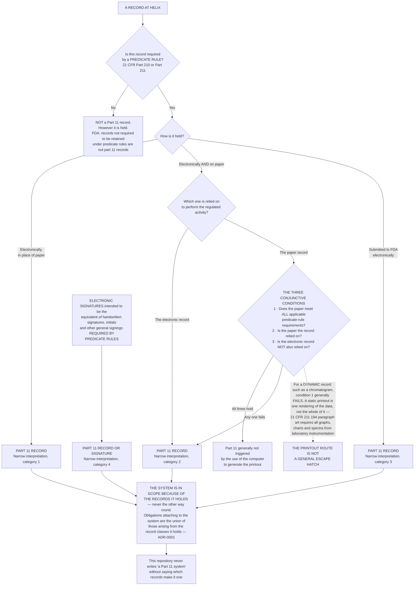

# Diagram — What Part 11 Reaches: Records, Not Systems

| Field | Value |
|---|---|
| Version | 1.0 |
| Date | 2026-05-29 |
| Owner | Priyanka Venkataraman, Data Integrity Lead |
| Approver | Terrence Abbatiello, Head of Quality Assurance |
| Classification | Confidential — Helix Pharma, Inc. Data Integrity Programme // Illustrative Portfolio Sample |

*Phase 01 speaks as at **2026-05-29**. Helix Pharma is fictional and illustrative. 21 CFR Part 11, the
predicate rules and FDA's August 2003 Scope and Application guidance are real and are cited at
`01.03` and `01.04`.*

---

**Part 11 applies to records. It does not apply to systems.** `21 CFR 11.1(b)` says the part *"applies
to records in electronic form"*, and FDA's narrow interpretation reaches the four categories drawn
above. Every one of them starts from a predicate rule — for Helix, 21 CFR Part 211. **A system is in
scope because of what it holds.** `01.03 §2` owns that argument and `ADR-0001` records the decision.

**The left branch matters as much as the right.** FDA is explicit that records not required to be
retained under a predicate rule are not Part 11 records, however they are held. A programme that treats
every file on every GxP server as a Part 11 record has taken on obligations no citation supports, and
will not be able to answer *which requirement does this control discharge*.

**The three conjunctive conditions are the part most often misquoted.** The printout route is regularly
summarised as *if you print it, Part 11 does not apply*. All three conditions must hold together, and
for a dynamic record — a chromatogram a reviewer reprocesses, reintegrates and interrogates — the first
condition generally fails. Phase 07 exists to ask that question honestly rather than to reach for the
answer.

**Nothing on this chart has been applied to any Helix record.** At the vantage of **2026-05-29** there
is no system inventory and **no Part 11 applicability determination for any record class or any
system**. The diagram draws the method that Phase 02 will apply, and states nothing about what Phase 02
will conclude.

Two things this diagram deliberately does not draw, because Part 11 does not contain them: a
reason-for-change field, and any logging of read or view events. `21 CFR 11.10(e)` reaches *"operator
entries and actions that create, modify, or delete electronic records"* and requires that record changes
not obscure previously recorded information. `01.03 §8` lists what Part 11 does not require.

## Cross-References

| Document | Relationship |
|---|---|
| [01.03 What Part 11 Actually Is](../01.03-what-part-11-actually-is.md) | Owns the argument at `§2` and the printout test at `§7` |
| [01.04 The Predicate Rules and Enforcement Discretion](../01.04-the-predicate-rules-and-enforcement-discretion.md) | The predicate rules the left-hand test turns on |
| [01.01 The Company and What It Makes](../01.01-the-company-and-what-it-makes.md) | The six GxP-critical platforms whose records Phase 02 will assess |
| [adr/ADR-0001 Part 11 Applicability Is Determined Record by Record](../adr/ADR-0001-part-11-applicability-is-determined-record-by-record.md) | The decision this diagram draws |
| [templates/](../templates/) | The Part 11 record applicability determination form |

← [diagrams/01-the-four-regulations-assessed.md](01-the-four-regulations-assessed.md) · [Phase 01 README](../01.00-README.md) · [diagrams/01-governance-and-the-three-way-separation.md](01-governance-and-the-three-way-separation.md) →
