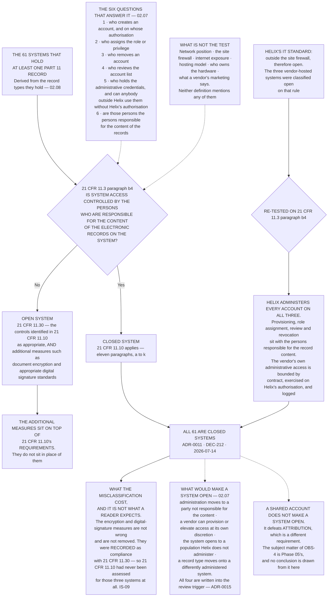

# Diagram — Open and Closed, and the Test That Decides

| Field | Value |
|---|---|
| Version | 1.0 |
| Date | 2026-07-31 |
| Owner | Joachim Reuter, Head of Automation and Manufacturing IT |
| Approver | Amara Sissoko, Chief Information Officer |
| Classification | Confidential — Helix Pharma, Inc. Data Integrity Programme // Illustrative Portfolio Sample |

*Phase 02 speaks as at **2026-07-31**. Helix Pharma and its systems are fictional and illustrative.
**21 CFR Part 11 is real**, and `21 CFR 11.3(b)(4)`, `21 CFR 11.3(b)(9)` and `21 CFR 11.30` are quoted
verbatim at `02.07`.*

---

**The two definitions differ by one word.** `21 CFR 11.3(b)(4)` and `21 CFR 11.3(b)(9)` are the same
sentence with *not* inserted, and neither of them mentions a network, a firewall, a hosting arrangement or
a location. **The test is a governance question, not an infrastructure question**: do the people
responsible for the content of the records control who gets into the environment those records sit in?

**The network-position rule fails in both directions, and the direction Helix failed in is the one that
looks safe.** Treating a closed system as open appears conservative — more controls, not fewer. At Helix it
produced the opposite result, because the measures deployed under `21 CFR 11.30` were recorded as the
answer, and **the eleven paragraphs of `21 CFR 11.10` were never assessed for those three systems at all.**
That is `IS-09`, and it is an unassessed position rather than an adverse one.

**Nothing on this chart removes a control.** The encryption and the digital signatures stay. They are not
required for a closed system — `21 CFR 11.70` sets the standard for signature-record linking as preventing
transfer to falsify a record *"by ordinary means"* and mandates no cryptographic hashing — so retaining
them is **Helix's decision**, recorded as Helix's decision and not as a requirement.

**And nothing on this chart is a compliance statement.** All sixty-one are closed systems, which means
`21 CFR 11.10` is the section that reaches them. **Whether any of the sixty-one satisfies any paragraph of
it has not been assessed**, by anybody, at this vantage. There is no Part 11 certification, no
FDA-approved software and no FDA-validated software; a vendor supplies features that support compliance.

## Cross-References

| Document | Relationship |
|---|---|
| [02.07 Open and Closed](../02.07-open-and-closed.md) | **Owns this determination**, quotes the definitions verbatim, and carries `IS-09` |
| [02.08 The Sixty-One and the Thirty-Five](../02.08-the-sixty-one-and-the-thirty-five.md) | Where the sixty-one come from |
| [02.09 The Systems Register](../02.09-the-systems-register.md) | Where the classification is carried, and the review trigger at `§5` |
| [02.12 What the Determination Costs](../02.12-what-the-determination-costs.md) | `IS-09` stated as work, and `PR-12` |
| [01.03 What Part 11 Actually Is](../../01-program-foundation-and-regulatory-scoping/01.03-what-part-11-actually-is.md) | `§4` fixed this test in Phase 01 |
| [01.02 The Inspection and the Form FDA 483](../../01-program-foundation-and-regulatory-scoping/01.02-the-inspection-and-the-form-483.md) | `OBS-4`, and what a Form FDA 483 is |
| [adr/ADR-0011 Open and closed are determined on who controls access](../adr/ADR-0011-open-and-closed-are-determined-on-who-controls-access.md) | The decision this chart draws |
| [adr/ADR-0015 The determination is a controlled document with a review trigger](../adr/ADR-0015-the-determination-is-a-controlled-document-with-a-review-trigger.md) | The trigger the dotted branch feeds |
| [logs/systems-register.md](../logs/systems-register.md) | The closed determination carried per system |

← [diagrams/02-the-paper-printout-test.md](02-the-paper-printout-test.md) · [Phase 02 README](../02.00-README.md) · [diagrams/02-the-inventory-corrected.md](02-the-inventory-corrected.md) →
