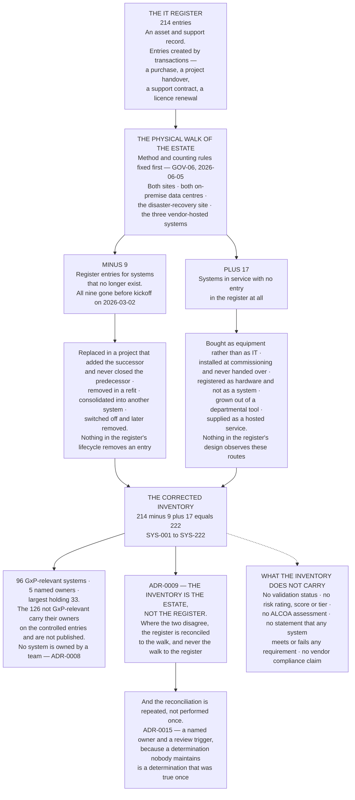

# Diagram — The Inventory Corrected: 214 to 222

| Field | Value |
|---|---|
| Version | 1.0 |
| Date | 2026-07-31 |
| Owner | Amara Sissoko, Chief Information Officer |
| Approver | Joachim Reuter, Head of Automation and Manufacturing IT |
| Classification | Confidential — Helix Pharma, Inc. Data Integrity Programme // Illustrative Portfolio Sample |

*Phase 02 speaks as at **2026-07-31**. Helix Pharma, its estate and every figure drawn here are fictional
and illustrative. **21 CFR 211.68 is real** and is cited at `02.01` and `02.02`.*

---

**The drift ran in both directions at once, and that is the part worth pausing on.** A register that only
gained entries could be corrected by a purge. A register that only lost them could be corrected by an
audit of what is running. **Helix's did both**, which means no single reconciliation habit — in either
direction — would have found all of it, and nothing in the quality system was performing either.

**Twenty-six movements on a base of two hundred and fourteen is not a scandal.** An asset register drifts
because asset registers are maintained by transactions and estates change without them. What matters is
that a determination made on the register would have been a determination about a population that was not
the population — and the Part 11 applicability determination this phase exists to make takes the inventory
as its input.

**The counting rules are why the number is checkable.** A computerised system is counted once as the
function it performs, however many servers it runs on; an instrument with its own administration and its
own local storage of results is a system in its own right; an instrument that stores nothing and writes
only into a controlling application is counted with that application; hosting changes neither the count nor
the entry's status. `02.01 §6` sets out all seven rules. **A different rule set would produce a different
honest number**, which is exactly why the rules were fixed at `GOV-06` before the walk rather than written
up after it.

**Nothing on this chart is a determination about any system.** Whether any of the 222 is GxP-relevant is
`02.03`'s; which record types they hold is `02.05`'s; which of them hold Part 11 records is `02.08`'s;
whether they are closed or open is `02.07`'s. **The chart draws an inventory, and an inventory is the
input to a determination rather than the determination itself.**

## Cross-References

| Document | Relationship |
|---|---|
| [02.02 The Inventory, Corrected](../02.02-the-inventory-corrected.md) | **Owns this arithmetic** and argues `ADR-0009` at `§3` |
| [02.01 What an Inventory Is For](../02.01-what-an-inventory-is-for.md) | The counting rules and the walk method drawn at the top of the chart |
| [02.03 What Makes a System GxP-Relevant](../02.03-what-makes-a-system-gxp-relevant.md) | What happens to the 222 next |
| [02.09 The Systems Register](../02.09-the-systems-register.md) | `SYS-001` to `SYS-222`, and the review trigger |
| [adr/ADR-0009 The inventory is the estate, not the register](../adr/ADR-0009-the-inventory-is-the-estate-not-the-register.md) | The decision the chart's lower half draws |
| [adr/ADR-0015 The determination is a controlled document with a review trigger](../adr/ADR-0015-the-determination-is-a-controlled-document-with-a-review-trigger.md) | Why the reconciliation repeats |
| [logs/systems-register.md](../logs/systems-register.md) | The 222 entries, with the seventeen additions and the nine removals |

← [diagrams/02-open-and-closed.md](02-open-and-closed.md) · [Phase 02 README](../02.00-README.md) · [diagrams/02-the-scope-funnel.md](02-the-scope-funnel.md) →
