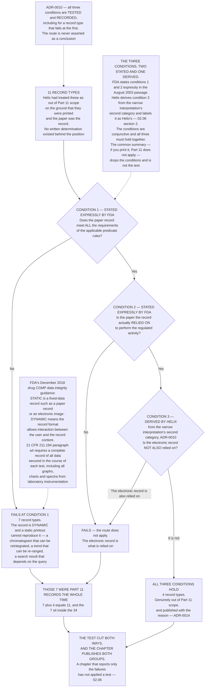

# Diagram — The Paper-Printout Test: Three Conditions, Two Stated and One Derived, and Where the Seven Fail

| Field | Value |
|---|---|
| Version | 1.0 |
| Date | 2026-07-31 |
| Owner | Dr Sunita Raghunathan, Head of Quality Control |
| Approver | Priyanka Venkataraman, Data Integrity Lead |
| Classification | Confidential — Helix Pharma, Inc. Data Integrity Programme // Illustrative Portfolio Sample |

*Phase 02 speaks as at **2026-07-31**. Helix Pharma and its record types are fictional and illustrative.
**FDA's August 2003 Scope and Application guidance, FDA's December 2018 drug CGMP data integrity guidance
and 21 CFR Part 211 are real**, and the passages relied on are quoted at `01.03 §7` and `02.06`.*

---

**The whole of the disagreement sits in condition one.** Everything else in the printout route is about
practice — what a person reads, what a person signs, whether anybody goes back to the system. Condition one
is about the record: whether the paper contains everything the predicate rule requires the record to
contain. **For a record a reviewer interacts with, a printed rendering is one view of the record and not
the record**, and that is a property of the record rather than an opinion about it.

**Four record types survive the test and are genuinely out of scope**, and they matter as much as the
seven. A determination that could only ever produce one answer is not a test, and a register that publishes
its exclusions without their reasons publishes something indistinguishable from an oversight — which is
`ADR-0014`.

**`02.06-the-paper-that-was-not-the-record.md` owns this argument, names the seven and the four, and
records what each of the three conditions produced for each of the eleven.** This chart draws the shape of
the test and the counts; it argues nothing and it names no record type.

**One boundary is drawn on the chart and nowhere else in this phase.** Three of the seven are
chromatography data system record types and bear on the subject matter of `OBS-2`. **`02.06` records that
link and draws no conclusion from it**, and neither does this diagram: what it means is Phase 06's and
Phase 08's. **A Form FDA 483 is not a legal finding**, and nothing here characterises anything as a
violation of anything.

**What the chart does not draw**, because Part 11 does not contain them: a reason-for-change field, and any
logging of read or view events. `21 CFR 11.10(e)` reaches *"operator entries and actions that create,
modify, or delete electronic records"* and requires that record changes not obscure previously recorded
information. `01.03 §8` lists what Part 11 does not require.

## Cross-References

| Document | Relationship |
|---|---|
| [02.06 The Paper That Was Not the Record](../02.06-the-paper-that-was-not-the-record.md) | **Owns this test, the seven and the four** — `7 + 4 = 11` |
| [02.05 The Fifty-Eight Record Types](../02.05-the-fifty-eight-record-types.md) | The enumeration the seven sit inside — `34 + 24 = 58` |
| [02.04 The Record Type as the Unit of Determination](../02.04-the-record-type-as-the-unit-of-determination.md) | Why the test is applied to a record type |
| [02.12 What the Determination Costs](../02.12-what-the-determination-costs.md) | What the seven cost in work |
| [01.03 What Part 11 Actually Is](../../01-program-foundation-and-regulatory-scoping/01.03-what-part-11-actually-is.md) | `§7` — the three conditions, fixed in Phase 01, and `§8` — what Part 11 does not require |
| [adr/ADR-0010 The paper-printout route is tested against all three of its conditions](../adr/ADR-0010-the-paper-printout-route-is-tested-not-asserted.md) | The decision the chart's method note draws |
| [adr/ADR-0014 The out-of-scope record types are published with the reason each is out](../adr/ADR-0014-the-out-of-scope-record-types-are-published-with-their-reasons.md) | Why the four are published as fully as the seven |
| [logs/record-type-register.md](../logs/record-type-register.md) | `RT-01` to `RT-58`, with the reason each out-of-scope type is out |

← [diagrams/02-the-scope-funnel.md](02-the-scope-funnel.md) · [Phase 02 README](../02.00-README.md) · [diagrams/02-open-and-closed.md](02-open-and-closed.md) →
