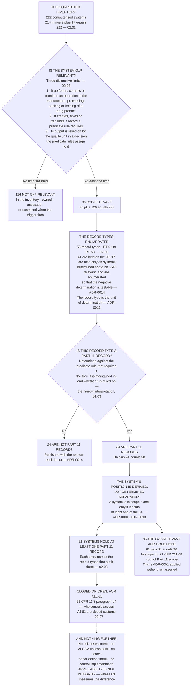

# Diagram — The Funnel: 222 Systems to 96 to 61, and 58 Record Types to 34

| Field | Value |
|---|---|
| Version | 1.0 |
| Date | 2026-07-31 |
| Owner | Priyanka Venkataraman, Data Integrity Lead |
| Approver | Terrence Abbatiello, Head of Quality Assurance |
| Classification | Confidential — Helix Pharma, Inc. Data Integrity Programme // Illustrative Portfolio Sample |

*Phase 02 speaks as at **2026-07-31**. Helix Pharma and every figure drawn here are fictional and
illustrative. **21 CFR Part 11 and 21 CFR Part 211 are real** and are cited in the chapters that own each
step.*

---

**Read the funnel from the top and it narrows. Read it from the middle and it does something more
interesting.** The systems column does not narrow on its own: **it narrows because the record types
narrowed first.** The 61 are not a judgement about 61 systems. They are the arithmetic consequence of 34
determinations about record types, applied to the systems that hold them, and every one of the 61 carries
the identifiers of the record types that put it there.

**The 35 are the branch that proves the method is a method.** Thirty-five systems are GxP-relevant, they
take part in regulated processes, they are subject to `21 CFR 211.68`, and **they hold no Part 11 record at
all.** A system-level sort would have swept them in or left them out depending on how the sorter felt
about the phrase *GxP system*. `ADR-0001` was taken in Phase 01, before anybody knew the estate contained
such a set, and `02.08` is the chapter that argues them.

**Two of the arrows are the ones that get misdrawn elsewhere.** GxP relevance does not imply Part 11
applicability — different question, different unit, different answer. And a system does not acquire scope
because of what it is called, its criticality or its platform status; it acquires scope from the records it
holds, which is why the derivation arrow runs from the record types to the systems and never the other way.

**This chart draws numbers and not names.** No record type and no system is identified on it. `RT-01` to
`RT-58` are enumerated at `02.05` and registered at `logs/record-type-register.md`; `SYS-001` to `SYS-222`
are at `logs/systems-register.md`. **A funnel is a shape, and the shape is the argument — the contents
belong in the registers, where they can be maintained.**

**And the dotted arrow at the bottom is the honest end of the phase.** The determination says which
records the requirements reach. **It says nothing about whether the data in any of them is any good**, and
nobody at Helix has yet asked. That question is `IS-11`, and Phase 03 is where it is measured.

## Cross-References

| Document | Relationship |
|---|---|
| [02.02 The Inventory, Corrected](../02.02-the-inventory-corrected.md) | The 222 at the top of the funnel |
| [02.03 What Makes a System GxP-Relevant](../02.03-what-makes-a-system-gxp-relevant.md) | **96 + 126 = 222** and the three limbs |
| [02.04 The Record Type as the Unit of Determination](../02.04-the-record-type-as-the-unit-of-determination.md) | Why the derivation arrow runs from record types to systems |
| [02.05 The Fifty-Eight Record Types](../02.05-the-fifty-eight-record-types.md) | **34 + 24 = 58** |
| [02.06 The Paper That Was Not the Record](../02.06-the-paper-that-was-not-the-record.md) | The seven record types inside the 34 that had been treated as out of scope |
| [02.07 Open and Closed](../02.07-open-and-closed.md) | The last step — all 61 are closed systems |
| [02.08 The Sixty-One and the Thirty-Five](../02.08-the-sixty-one-and-the-thirty-five.md) | **61 + 35 = 96**, and the argument the 35 carry |
| [adr/ADR-0013 A record type is the unit of determination](../adr/ADR-0013-a-record-type-is-the-unit-of-determination.md) | The decision the middle of the chart implements |
| [logs/record-type-register.md](../logs/record-type-register.md) | `RT-01` to `RT-58` |
| [logs/systems-register.md](../logs/systems-register.md) | `SYS-001` to `SYS-222` |

← [diagrams/02-the-inventory-corrected.md](02-the-inventory-corrected.md) · [Phase 02 README](../02.00-README.md) · [diagrams/02-the-paper-printout-test.md](02-the-paper-printout-test.md) →
