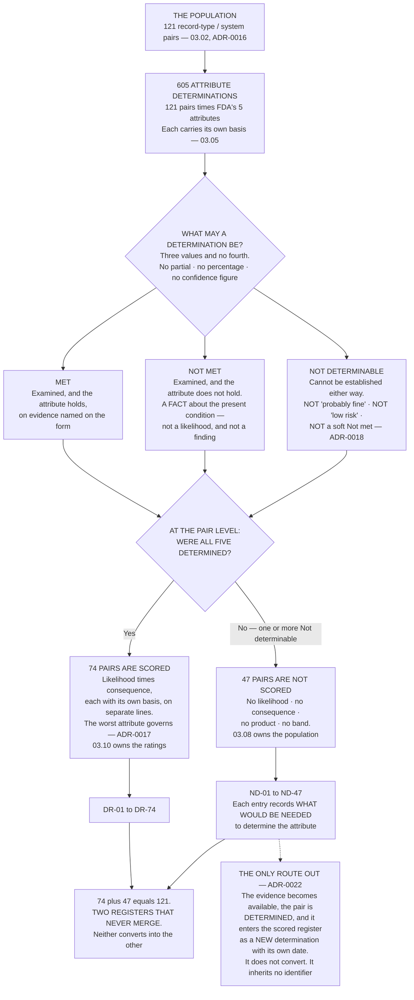

# Diagram — Determinable and Not: the 121 Dividing into 74 and 47

| Field | Value |
|---|---|
| Version | 1.0 |
| Date | 2026-09-30 |
| Owner | Terrence Abbatiello, Head of Quality Assurance |
| Approver | Priyanka Venkataraman, Data Integrity Lead |
| Classification | Confidential — Helix Pharma, Inc. Data Integrity Programme // Illustrative Portfolio Sample |

*Phase 03 speaks as at **2026-09-30**. Helix Pharma and every figure drawn here are fictional and illustrative. **21 CFR Part 211 is real** and is cited in the chapters that own each step.*

---

**What this diagram shows.** It draws the phase's central refusal. Six hundred and five attribute
determinations are made across one hundred and twenty-one pairs, and each determination may take one of
exactly three values — Met, Not met, Not determinable — and no fourth. The chart then shows what happens
at the pair level: **a pair whose five attributes were all determined is scored; a pair carrying even one
Not determinable attribute is not scored at all.** The two populations go to two registers that never merge
and neither converts into the other, and the only route out of the unscored register is a determination
made on a trigger. **The chart is drawn so that the refusal is a branch rather than a footnote**, because
the alternative arrangement — an undeterminable pair scored low, joining the same register as everything
else — is the one this phase exists to reject.

**What this diagram does not show.** **It shows no count of Met, Not met or Not determinable, for any
attribute or for the population.** How the six hundred and five determinations divide across the three
values is `03.06-the-assessment.md`'s and is held in the attribute determination register; how they divide
by attribute is `03.07-the-attribute-that-fails-most.md`'s. The three boxes in the middle of this chart are
the three values the instrument permits, not three populations with sizes.

**It shows no rating and no band.** How the seventy-four distribute across High, Moderate and Low is
`03.10`'s. The scale, the bands and the eleven impossible products are `03.05 §7`'s and are not drawn here.

**It names no pair, no record type and no system**, and it says nothing about which of the forty-seven are
the pairs generated by Phase 02's seven newly in-scope record types — `03.09` owns that.

**It states no validation status and no control position**, and nothing on it says whether any control at
Helix works. **A branch on this chart is not a finding, a deficiency or a violation**, and the phase says
so wherever a rating appears.

**And it does not show why any attribute could not be determined.** The chart shows that a value exists and
what happens when it is used. **What is missing, for which pair, is on the `ND` entry itself**, and the
reasons are `03.08`'s to report. A diagram that summarised forty-seven different absences into one shape
would be doing exactly what `ADR-0018` refuses.

## Cross-References

| Document | Relationship |
|---|---|
| [03.05 The Method and the Scale](../03.05-the-method-and-the-scale.md) | **Owns the three determinations at `§3` and the refusal at `§4`** |
| [03.02 The Unit of Assessment](../03.02-the-unit-of-assessment.md) | The 121 pairs at the top of the chart |
| [03.06 The Assessment](../03.06-the-assessment.md) | How the 605 determinations actually divided |
| [03.08 What Cannot Be Determined](../03.08-what-cannot-be-determined.md) | The unscored branch, and what it is handed to |
| [03.10 The Scored Risks](../03.10-the-scored-risks.md) | The scored branch, and what a rating authorises |
| [adr/ADR-0018 Not determinable is a determination and is not scored](../adr/ADR-0018-not-determinable-is-a-determination-and-is-not-scored.md) | The decision the branch implements |
| [adr/ADR-0017 The five attributes are never averaged](../adr/ADR-0017-the-five-attributes-are-never-averaged.md) | Why the worst attribute governs and nothing is combined |
| [adr/ADR-0022 The assessment is re-run on a trigger](../adr/ADR-0022-the-assessment-is-re-run-on-a-trigger.md) | The dotted route out of the unscored register |
| [logs/risk-register.md](../logs/risk-register.md) | `DR-01` to `DR-74` and `ND-01` to `ND-47`, in two tables |
| [templates/](../templates/) | The Not-determinable record, and the risk scoring record |

← [diagrams/03-fdas-own-mapping.md](03-fdas-own-mapping.md) · [Phase 03 README](../03.00-README.md) · [diagrams/03-the-flow-the-unit-does-not-see.md](03-the-flow-the-unit-does-not-see.md) →
