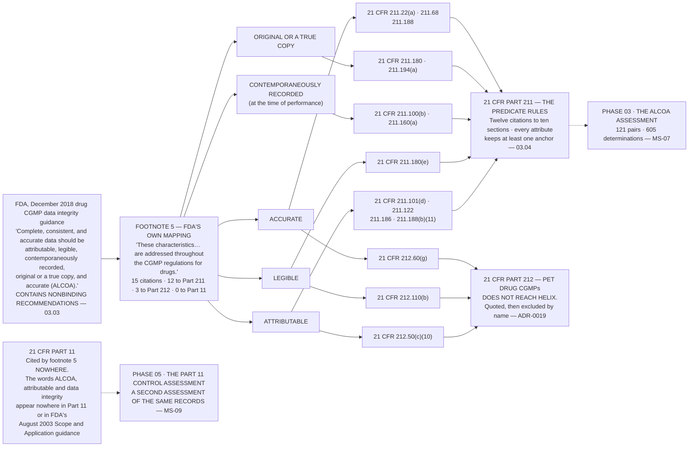

# Diagram — FDA's Own Mapping: Footnote 5, and the Arrow That Does Not Exist

| Field | Value |
|---|---|
| Version | 1.0 |
| Date | 2026-09-30 |
| Owner | Priyanka Venkataraman, Data Integrity Lead |
| Approver | Terrence Abbatiello, Head of Quality Assurance |
| Classification | Confidential — Helix Pharma, Inc. Data Integrity Programme // Illustrative Portfolio Sample |

*Phase 03 speaks as at **2026-09-30**. Helix Pharma is fictional and illustrative. **21 CFR Parts 11, 211 and 212 and FDA's December 2018 drug CGMP data integrity guidance are real**, and footnote 5 is quoted in full at `03.04 §2`.*

---

**What this diagram shows.** It draws footnote 5 of FDA's December 2018 drug CGMP data integrity guidance
— the only mapping of the five data integrity attributes to regulation that FDA has published. Each of the
five attributes is shown with the sections that footnote names for it, in FDA's own words and FDA's own
order. **Three of the fifteen citations are to 21 CFR Part 212, the PET drug CGMPs; Helix manufactures oral
solid dose pharmaceuticals and no PET drug, so those three are drawn and then marked as not reaching it
rather than being left off the chart.** The chart also draws the arrow that does not exist: **footnote 5
cites 21 CFR Part 11 nowhere**, and the industry crosswalk mapping the five attributes onto
`21 CFR 11.10(a)` to `(k)` has no FDA source. **The absent arrow is the point of the diagram.**

**What this diagram does not show.** **There is no arrow from any attribute to `21 CFR Part 11`, and its
absence is not an omission in the drawing.** No such arrow exists in FDA's footnote, and no document in
this repository draws one — `ADR-0019`. Part 11 appears only to be shown unconnected, and to carry the
dotted line to the assessment that is not this one.

**It states no determination and no rating.** Which attributes were met, failed or could not be determined
is `03.06`'s and `03.07`'s. **It states no control position for any paragraph of `21 CFR 11.10`, for any
system** — that is Phase 05's, `MS-09`, and this chart is part of the argument for why Phase 05 happens.

**It is not a control mapping and the attributes on it are not controls.** They describe properties a
record should have, and nothing here names a mechanism, an owner, a configuration or a frequency. **It
does not show which of these provisions Helix meets.** Every citation locates a requirement in the text;
**none asserts that Helix satisfies it.** **And it draws no ranking** — the five are shown in FDA's order,
side by side, because they are never averaged, weighted or traded off (`ADR-0017`), and **the chart has no
totals row for the same reason.**

## Cross-References

| Document | Relationship |
|---|---|
| [03.04 Footnote Five](../03.04-footnote-five.md) | **Owns this argument**, and quotes the footnote in full at `§2` |
| [03.03 The Five Attributes in FDA's Words](../03.03-the-five-attributes-in-fdas-words.md) | The sentence at the top of the chart |
| [adr/ADR-0019 ALCOA is not a control set](../adr/ADR-0019-alcoa-is-not-a-control-set.md) | The decision the absent arrow implements |
| [adr/ADR-0017 The five attributes are never averaged](../adr/ADR-0017-the-five-attributes-are-never-averaged.md) | Why there is no totals row |
| [02.05 The Fifty-Eight Record Types](../../02-the-system-inventory-and-part-11-applicability/02.05-the-fifty-eight-record-types.md) | The record types anchored on these provisions |
| [logs/attribute-determination-register.md](../logs/attribute-determination-register.md) | Where the citations are carried, pair by pair |

← [diagrams/03-the-join-that-makes-the-unit.md](03-the-join-that-makes-the-unit.md) · [Phase 03 README](../03.00-README.md) · [diagrams/03-determinable-and-not.md](03-determinable-and-not.md) →
