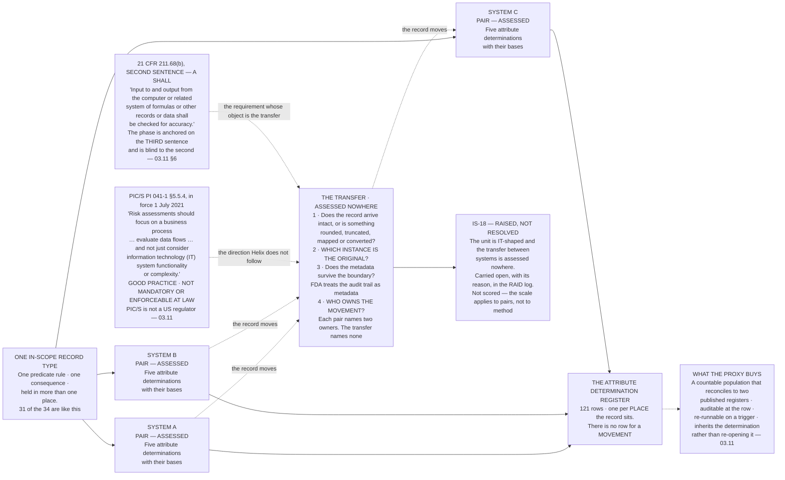

# Diagram — The Flow the Unit Does Not See

| Field | Value |
|---|---|
| Version | 1.0 |
| Date | 2026-09-30 |
| Owner | Joachim Reuter, Head of Automation and Manufacturing IT |
| Approver | Priyanka Venkataraman, Data Integrity Lead |
| Classification | Confidential — Helix Pharma, Inc. Data Integrity Programme // Illustrative Portfolio Sample |

*Phase 03 speaks as at **2026-09-30**. Helix Pharma and every figure drawn here are fictional and illustrative. **PIC/S PI 041-1 is real**, is good practice rather than a requirement, and is not enforceable at law.*

---

**What this diagram shows.** It draws the shape of the method's own limitation. One record type is shown
held on more than one system — which is the ordinary case at Helix, not the exception, because **thirty-one
of the thirty-four in-scope record types are held on more than one system.** The instrument assesses the
record on each of those systems, and each of those assessments is a solid box with five determinations
behind it. **Between them, where the record actually moves, the chart shows a dashed box with nothing in
it.** The four questions written into that gap are the questions the unit cannot ask: whether the record
arrives intact, which instance is the original, whether metadata survives the boundary, and who owns the
movement. The chart also shows the sentence Helix is departing from — PIC/S PI 041-1's direction, at
`§5.5.4`, that a risk assessment focus on business processes and data flows and *"not just consider
information technology (IT) system functionality or complexity"* — and the issue that carries the departure
forward. **And it shows the regulation the gap sits on.** `21 CFR 211.68(b)` provides, in the sentence
immediately before the one this phase is anchored on, that *"Input to and output from the computer or
related system of formulas or other records or data shall be checked for accuracy."* **That `shall` is
about the transfer, and the transfer is the dashed box.**

**What this diagram does not show.** **It does not show any actual data flow at Helix.** Systems A, B and C
are not identifiers and stand for no particular system; the record type stands for no particular record
type. **No flow has been mapped, and mapping the flows is the work this chart says has not been done.**

**It establishes nothing about any transfer.** No transfer between any two systems at Helix has been
examined. **Nothing here says that any record has been altered, lost or degraded in moving between
systems, and nothing here says that any has not. The position is unassessed, and unassessed is not
adverse.**

**It withdraws no determination and no rating.** The solid boxes are assessments that were made on
evidence, and the dashed box does not make them wrong. **It makes them incomplete**, which is what the
chart records.

**It shows no count of anything assessed** — no determinations by value, no ratings, no bands. It names no
record type, no system and no owner. **It states no validation status and no control position**, and
nothing on it says whether any control works.

**And it proposes no replacement unit.** A process-and-data-flow assessment needs the flows established
first, and inventing them inside a chart that has just criticised the phase for building on what was
available would be the same error twice. **`ADR-0022` makes the assessment re-runnable; whether the unit
changes when it is re-run is a question this phase leaves open.**

## Cross-References

| Document | Relationship |
|---|---|
| [03.11 The Flow the Unit Does Not See](../03.11-the-flow-the-unit-does-not-see.md) | **Owns this argument**, quotes PI 041-1 at `§2` and states the four questions at `§6` |
| [03.02 The Unit of Assessment](../03.02-the-unit-of-assessment.md) | The unit the chart criticises, and `§8` where the limitation is first named |
| [03.07 The Attribute That Fails Most](../03.07-the-attribute-that-fails-most.md) | The attribute the second question in the gap bears on |
| [03.13 Phase Summary and Transition](../03.13-phase-summary-and-transition.md) | Where `IS-18` goes |
| [adr/ADR-0016 The unit of assessment is the record-type/system pair](../adr/ADR-0016-the-unit-of-assessment-is-the-record-type-system-pair.md) | The process-based alternative, argued fairly and refused |
| [adr/ADR-0022 The assessment is re-run on a trigger](../adr/ADR-0022-the-assessment-is-re-run-on-a-trigger.md) | The mechanism by which a different unit could arrive |
| [02.09 The Systems Register](../../02-the-system-inventory-and-part-11-applicability/02.09-the-systems-register.md) | What the systems register carries, and what it deliberately does not |
| [logs/raid-log.md](../logs/raid-log.md) | **`IS-18` in its own wording, with its owner and date** |

← [diagrams/03-determinable-and-not.md](03-determinable-and-not.md) · [Phase 03 README](../03.00-README.md) →
