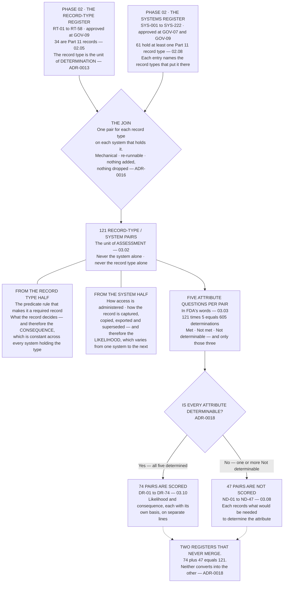

# Diagram — The Join That Makes the Unit: 34 Record Types and 61 Systems to 121 Pairs

| Field | Value |
|---|---|
| Version | 1.0 |
| Date | 2026-09-30 |
| Owner | Priyanka Venkataraman, Data Integrity Lead |
| Approver | Amara Sissoko, Chief Information Officer |
| Classification | Confidential — Helix Pharma, Inc. Data Integrity Programme // Illustrative Portfolio Sample |

*Phase 03 speaks as at **2026-09-30**. Helix Pharma and every figure drawn here are fictional and illustrative. **21 CFR Parts 11 and 211 are real** and are cited in the chapters that own each step.*

---

**What this diagram shows.** It shows where Phase 03's population comes from, and that it comes from
somewhere rather than from a decision. The two inputs are Phase 02's published registers — the record-type
register and the systems register — and the operation between them is a join, not a selection. Each
in-scope record type is paired with each system Phase 02 recorded as holding it, and the pairs that fall
out are the units this phase assesses. **The chart is drawn to make one property visible: the population
is derivable, so a reader with the two registers can re-run it and get the same number.** It also shows
the two halves of what a pair carries — the record type contributing the predicate rule and what the
record decides, the system contributing how the record is actually held — and it shows the routing at the
end, where each pair goes to one of two registers that never merge.

**What this diagram does not show.** **It shows no determination and no rating.** Which attribute any pair
met, failed or could not answer is in the attribute determination register and is argued at `03.06` and
`03.07`; the bands attached to the seventy-four are `03.10`'s. **No record type and no system is named on
it**, and **the counts of pairs per record type and per system are `03.06 §2`'s**, not drawn here. It does not show the scale, the bands or the impossible products — `03.05 §7`. It shows no
control, no configuration and no validation status, and **it shows nothing about `21 CFR 11.10`**: the
join operates on the applicability determination's outputs and says nothing about whether any control in
Part 11 is met for any system, which is Phase 05's question.

**And it does not show the movement between the systems in the middle column.** Every arrow on this chart
runs from a register to a pair; **there is no arrow between two systems holding the same record type**, and
thirty-one of the thirty-four in-scope record types are held on more than one system. That absence is the
shape of the method's known limitation, and `03.11-the-flow-the-unit-does-not-see.md` argues it with
`IS-18`. **A join that produces a countable population is not a model of how data moves, and this chart
should not be read as one.**

## Cross-References

| Document | Relationship |
|---|---|
| [03.02 The Unit of Assessment](../03.02-the-unit-of-assessment.md) | **Owns the argument at `§2` and the join at `§5`** |
| [03.03 The Five Attributes in FDA's Words](../03.03-the-five-attributes-in-fdas-words.md) | The five questions in the middle of the chart |
| [03.05 The Method and the Scale](../03.05-the-method-and-the-scale.md) | The three determinations and the routing at `§3` and `§4` |
| [03.06 The Assessment](../03.06-the-assessment.md) | The 605 determinations and how the population divides |
| [03.11 The Flow the Unit Does Not See](../03.11-the-flow-the-unit-does-not-see.md) | The arrows this chart does not have |
| [adr/ADR-0016 The unit of assessment is the record-type/system pair](../adr/ADR-0016-the-unit-of-assessment-is-the-record-type-system-pair.md) | The decision the join implements |
| [adr/ADR-0018 Not determinable is a determination and is not scored](../adr/ADR-0018-not-determinable-is-a-determination-and-is-not-scored.md) | The routing at the foot of the chart |
| [02.05 The Fifty-Eight Record Types](../../02-the-system-inventory-and-part-11-applicability/02.05-the-fifty-eight-record-types.md) | Where the 34 come from |
| [02.08 The Sixty-One and the Thirty-Five](../../02-the-system-inventory-and-part-11-applicability/02.08-the-sixty-one-and-the-thirty-five.md) | Where the 61 come from |
| [logs/attribute-determination-register.md](../logs/attribute-determination-register.md) | The 121 pairs as a controlled register |
| [logs/risk-register.md](../logs/risk-register.md) | `DR-01` to `DR-74` and `ND-01` to `ND-47` |

← [Phase 03 README](../03.00-README.md) · [diagrams/03-fdas-own-mapping.md](03-fdas-own-mapping.md) →
