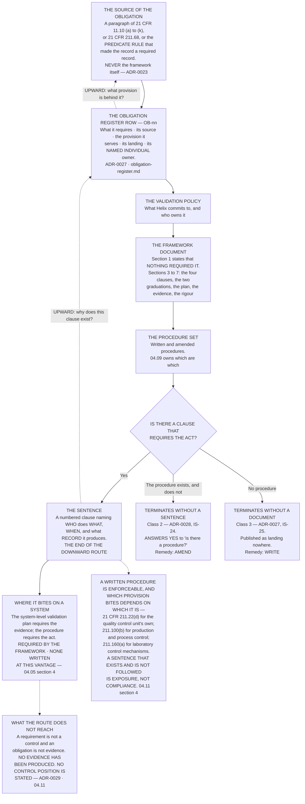

# Diagram — From an Obligation to the Sentence That Requires It

| Field | Value |
|---|---|
| Version | 1.0 |
| Date | 2026-11-30 |
| Owner | Priyanka Venkataraman, Data Integrity Lead |
| Approver | Terrence Abbatiello, Head of Quality Assurance |
| Classification | Confidential — Helix Pharma, Inc. Data Integrity Programme // Illustrative Portfolio Sample |

*Phase 04 speaks as at **2026-11-30**. Helix Pharma and every figure drawn here are fictional and illustrative. **21 CFR Part 11 and 21 CFR Part 211 are real** and are cited in the chapters that own each step.*

---

**What this diagram shows.** It draws the route a reader can walk in either direction, and the two
directions ask different questions. **Downward: given this obligation, what sentence, in what document,
requires somebody to do it?** **Upward: given this sentence in a procedure, what obligation does it
discharge, and what provision of the regulations is behind it?** The chart shows the layers the route
passes through — the regulation, the obligation register row, the policy, the framework document, the
procedure and finally the clause that requires the act — and the two places it can terminate without
reaching a sentence: **a procedure that exists and does not require the act, and no procedure at all.**
**The point is that a route which cannot be walked upward is a route in which a requirement exists
somewhere and nobody can find out why.** The architecture and every count are
`../04.09-the-policy-architecture.md`'s; this chart draws the shape.

**What this diagram does not show.** **It shows no count.** How many obligations exist, how many reach a
sentence and how many terminate at either dead end are `../04.06-the-obligations.md`'s and
`../04.08-where-the-obligations-land.md`'s. **The two termination boxes are permitted outcomes, not
populations with sizes.**

**It names no document, no procedure and no clause.** The layers are drawn; **which documents Helix writes
and what each is called is `../04.09-the-policy-architecture.md`'s.**

**It shows no sequence and no date.** The order in which procedures are written or amended, and what it
displaces, is `../04.10-what-the-framework-costs.md`'s. **No date after 2026-11-30 appears anywhere on this
chart as an accomplished fact.**

**It states no control position and no validation status.** A sentence in a procedure requires an act; it
does not establish that the act is performed, that evidence exists, or that any paragraph of
`21 CFR 11.10` is met for any system — `ADR-0029`, `IS-20`, `IS-09`. **And it states nothing about whether
any procedure at Helix is followed:** this phase examined no procedure's performance.

**And it is not an approval route or a document hierarchy for change control.** Who approves what runs
through the quality unit under **`21 CFR 211.22(c)`**, which makes the quality control unit responsible for
approving or rejecting all procedures or specifications impacting on the identity, strength, quality and
purity of the drug product; **for production and process control procedures, `21 CFR 211.100(a)`
additionally requires** that the procedures, including any changes, be reviewed and approved by the quality
control unit. That route is not drawn here.

## Cross-References

| Document | Relationship |
|---|---|
| [04.09 The Policy Architecture](../04.09-the-policy-architecture.md) | **Owns the architecture, the documents at each layer, and the route this chart draws the shape of** |
| [04.06 The Obligations](../04.06-the-obligations.md) | The obligations that enter at the second box |
| [04.08 Where the Obligations Land](../04.08-where-the-obligations-land.md) | The two terminations, and the counts |
| [04.05 The Framework](../04.05-the-framework.md) | `§2` the framework document's sections; `§4` the validation plan |
| [04.11 What a Framework Cannot Fix](../04.11-what-a-framework-cannot-fix.md) | `§2` and `§4` — the two dotted boxes; `ADR-0023` for why the top box is a regulation and never the framework |
| [adr/ADR-0027 Every obligation lands somewhere or is recorded as landing nowhere](../adr/ADR-0027-every-obligation-lands-somewhere-or-is-recorded-as-landing-nowhere.md) | The register row, and the third termination; `ADR-0028` the second |
| [logs/obligation-register.md](../logs/obligation-register.md) | The rows the upward route resolves to |
| [templates/](../templates/) | The obligation record, and the system validation plan |
| [01.07 Roles, Governance and the Quality Unit](../../01-program-foundation-and-regulatory-scoping/01.07-roles-governance-and-the-quality-unit.md) | The quality unit's statutory position, and who may not do what |

← [diagrams/04-where-the-obligations-land.md](04-where-the-obligations-land.md) · [Phase 04 README](../04.00-README.md)
