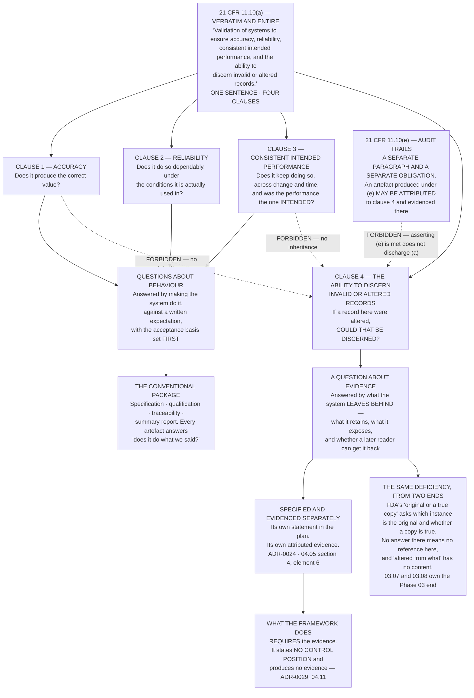

# Diagram — The Four Clauses of `21 CFR 11.10(a)`, and the One That Is Not Inherited

| Field | Value |
|---|---|
| Version | 1.0 |
| Date | 2026-11-30 |
| Owner | Colm Ó Braonáin, Computerised System Validation Lead |
| Approver | Dr Marguerite Oyelaran, Vice President, Quality |
| Classification | Confidential — Helix Pharma, Inc. Data Integrity Programme // Illustrative Portfolio Sample |

*Phase 04 speaks as at **2026-11-30**. Helix Pharma and every figure drawn here are fictional and illustrative. **21 CFR Part 11 and 21 CFR Part 211 are real** and are cited in the chapters that own each step.*

---

**What this diagram shows.** It takes one sentence of regulation apart. `21 CFR 11.10(a)` is nineteen
words long and contains four clauses, and the chart shows what each clause asks, what shape of evidence
answers it, and where in a validation package that evidence conventionally lives. **The first three clauses
are questions about behaviour and are answered by making the system do something in front of a witness.
The fourth is a question about evidence — whether the system affords a means of telling, afterwards, that a
record is invalid or has been altered — and it is answered by asking what the system leaves behind.** The
chart draws the fourth on its own route for that reason, and draws the two arguments that are commonly used
to avoid drawing it at all — inheritance from the first three, and an assertion that `21 CFR 11.10(e)` is
met standing in place of evidence attributed to the clause — as forbidden. **An artefact produced under
`(e)` may be attributed to the fourth clause and evidenced there; what the chart forbids is the assertion
substituted for the attribution.** **It also shows the join that makes the phase: the fourth clause and
FDA's *original or a true copy* attribute are two questions that fail together**, because a system on which
nobody can say which instance is the original has nothing for *altered from what* to mean.

**What this diagram does not show.** **It shows no result.** How many validation packages Helix holds, what
they address and what none of them addresses is `../04.07-the-packages-helix-already-holds.md`'s. The four
boxes below the regulation are four clauses of a sentence, not four populations with sizes.

**It states no control position, no validation status and no validation outcome.** Nothing here says that
`21 CFR 11.10(a)`, or any of its clauses, is met or is not met for any system; no system is validated by
anything drawn here; and **no system-level validation plan is written at this vantage** — `ADR-0029`,
`IS-20`, `IS-09`.

**It is not a map of ALCOA onto `21 CFR 11.10`.** The join box records that two obligations from two sources
fail for one underlying reason. **It is not a crosswalk, and FDA's only published mapping of the five
attributes is footnote 5, which cites the predicate rules and cites Part 11 nowhere** — `ADR-0019`.

**It configures no audit trail and sets no review frequency.** The box naming `21 CFR 11.10(e)` is there to
show that an assertion about one paragraph does **not** discharge another. **No primary source names a review frequency and this phase
names none.**

**And it names no system, no record type and no pair.** The forty-one referred to in the join is Phase 03's
published figure, cited from `03.07` and not re-derived.

## Cross-References

| Document | Relationship |
|---|---|
| [04.03 The Fourth Clause](../04.03-the-fourth-clause.md) | **Owns the paragraph at `§1`, the four clauses at `§2`, and the join at `§5`** |
| [04.05 The Framework](../04.05-the-framework.md) | `§4` element 6 and `§5` row `(a)` — the requirement in the plan and the evidence table |
| [04.07 The Packages Helix Already Holds](../04.07-the-packages-helix-already-holds.md) | What the existing packages address — the result this chart does not draw |
| [adr/ADR-0024 The four clauses are evidenced separately](../adr/ADR-0024-the-four-clauses-are-evidenced-separately.md) | **The decision the separate route implements**, and the two forbidden arrows |
| [adr/ADR-0029 The framework states no control position](../adr/ADR-0029-the-framework-states-no-control-position.md) | Why the last box says what it says |
| [03.07 The Attribute That Fails Most](../../03-data-integrity-risk-assessment-and-the-alcoa-attributes/03.07-the-attribute-that-fails-most.md) | **The Phase 03 end of the join**, with `03.08` for the population it sits inside |
| [01.03 What Part 11 Actually Is](../../01-program-foundation-and-regulatory-scoping/01.03-what-part-11-actually-is.md) | The eleven paragraphs of `21 CFR 11.10`, and what Part 11 does not require |

← [Phase 04 README](../04.00-README.md) · [diagrams/04-two-graduations.md](04-two-graduations.md) →
