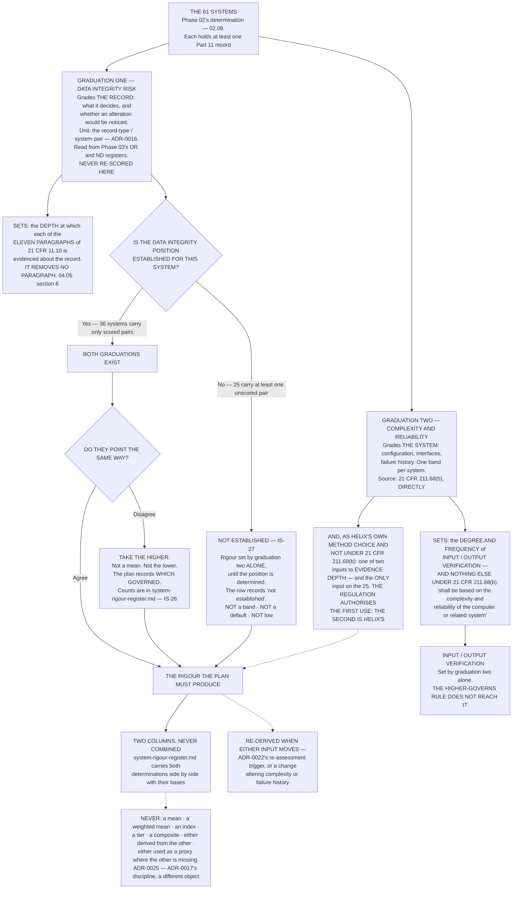

# Diagram — Two Graduations, and What Happens Where They Disagree

| Field | Value |
|---|---|
| Version | 1.0 |
| Date | 2026-11-30 |
| Owner | Joachim Reuter, Head of Automation and Manufacturing IT |
| Approver | Colm Ó Braonáin, Computerised System Validation Lead |
| Classification | Confidential — Helix Pharma, Inc. Data Integrity Programme // Illustrative Portfolio Sample |

*Phase 04 speaks as at **2026-11-30**. Helix Pharma and every figure drawn here are fictional and illustrative. **21 CFR Part 211 and 21 CFR Part 11 are real** and are cited in the chapters that own each step.*

---

**What this diagram shows.** It draws the answer to `DP-15`. Phase 03 anchored its method on
`21 CFR 211.68(b)`, which graduates a control on *"the complexity and reliability of the computer or
related system"*, and then published the fact that neither axis of its own scale is complexity or
reliability. **Helix does not reconcile the two. It keeps two graduations, in two columns that are never
combined, and derives neither from the other.** The chart shows what each grades, what each sets, and the
one place they meet: **where they point in different directions the framework requires the higher of the
two, and that rule reaches the evidence requirement only — it never reaches the degree and frequency of
input/output verification, which the regulation graduates on complexity and reliability alone.** The chart
also draws the twenty-five systems with no established data integrity position on their own branch, because
their rigour is set by one graduation and that is a recorded consequence rather than a default.
**`21 CFR 211.68(b)` authorises the complexity-and-reliability band to set input/output verification and
nothing else; the framework's second use of the same band, as an input to evidence depth, is Helix's own
method choice and is drawn and labelled as Helix's.**

**What this diagram does not show.** **It shows no band and no distribution.** How the sixty-one divide
across High, Medium and Low on graduation two, and how many systems the two graduations agree and disagree
on, are in `../logs/system-rigour-register.md` and are cited rather than drawn. The boxes on this chart are
the rules the register was built with, not the register's contents.

**It shows no rigour outcome for any named system**, and it names no system, no record type and no pair.

**It states no control position and no validation status.** Nothing here says whether any paragraph of
`21 CFR 11.10` is met for any system, and **a rigour band is not a validation status** — `ADR-0029`,
`IS-20`. **It sets no input/output verification for any system**: it shows what sets it, and **no
system-level validation plan is written at this vantage.**

**It re-scores nothing.** Phase 03's registers enter as an input: **no pair's determination moves and no
`ND` identifier becomes a `DR` identifier** — `ADR-0018`.

**It cites `21 CFR 211.68(b)` for nothing beyond that provision's own subject matter.** No audit trail, no
access arrangement, no review and no retention period is sized by either branch, and **the framework's
second use of the complexity-and-reliability band is not made under that provision**. **A regulation cited
beyond its own subject matter stops being a citation.** **And it does not close `IS-18`:** graduating the degree and
frequency of a verification is not an assessment of the movement being verified.

## Cross-References

| Document | Relationship |
|---|---|
| [04.04 Two Graduations](../04.04-two-graduations.md) | **Owns the argument** — `§3` the two, `§5` why not merged, `§6` the higher-governs rule, `§7` the twenty-five |
| [04.02 What the Framework Has to Answer](../04.02-what-the-framework-has-to-answer.md) | `§4` — the 36 and the 25; `§5.1` — `DP-15` |
| [04.05 The Framework](../04.05-the-framework.md) | `§6` — the eight rigour rules this chart implements |
| [adr/ADR-0025 Two graduations, never merged](../adr/ADR-0025-two-graduations-never-merged.md) | **The decision the chart draws**, and the forbidden box |
| [logs/system-rigour-register.md](../logs/system-rigour-register.md) | **The two columns, and every count this chart declines to state** |
| [logs/raid-log.md](../logs/raid-log.md) | **`IS-26`**, **`IS-27`**, and `DP-15` closing |
| [03.01 Nothing Required This](../../03-data-integrity-risk-assessment-and-the-alcoa-attributes/03.01-nothing-required-this.md) | `§5` — `21 CFR 211.68(b)` in full, and the rule about subject matter |
| [03.08 What Cannot Be Determined](../../03-data-integrity-risk-assessment-and-the-alcoa-attributes/03.08-what-cannot-be-determined.md) | The forty-seven behind the twenty-five branch; `03.05 §5` for the never-average discipline |
| [templates/](../templates/) | The complexity-and-reliability determination record, and the system validation plan |

← [diagrams/04-the-four-clauses.md](04-the-four-clauses.md) · [Phase 04 README](../04.00-README.md) · [diagrams/04-where-the-obligations-land.md](04-where-the-obligations-land.md) →
