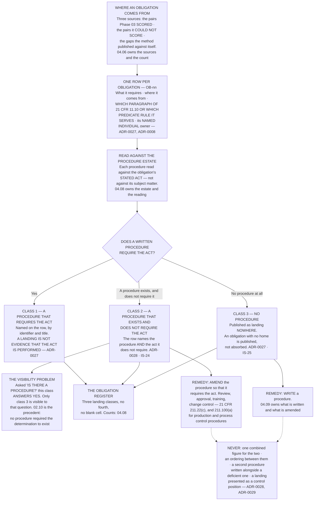

# Diagram — Where an Obligation Lands: Three Classes and No Fourth

| Field | Value |
|---|---|
| Version | 1.0 |
| Date | 2026-11-30 |
| Owner | Terrence Abbatiello, Head of Quality Assurance |
| Approver | Priyanka Venkataraman, Data Integrity Lead |
| Classification | Confidential — Helix Pharma, Inc. Data Integrity Programme // Illustrative Portfolio Sample |

*Phase 04 speaks as at **2026-11-30**. Helix Pharma and every figure drawn here are fictional and illustrative. **21 CFR Part 211 and 21 CFR Part 11 are real** and are cited in the chapters that own each step.*

---

**What this diagram shows.** It draws the **structure** of the landing decision, not its results. An
obligation arises, is recorded on its own row with its source and the provision it serves, and is read
against the procedure estate. **Exactly three landings are permitted, with no fourth and no blank cell** —
a procedure that requires the act; a procedure that exists and does not require the act; or no procedure at
all. The chart draws the middle class on its own branch because it is the class the obvious audit question
cannot see: **asked *is there a procedure?*, a middle-class landing answers yes, and the act still is not
required of anybody.** It also shows the two remedies, which are different acts consuming different
capacity. **Every count behind these branches is in `../logs/obligation-register.md` and in
`../04.08-where-the-obligations-land.md`; this chart states none of them.**

**What this diagram does not show.** **It shows no count.** How many obligations exist, how they divide
across the three sources, and how many landed in each class are `../04.06-the-obligations.md`'s and
`../04.08-where-the-obligations-land.md`'s. **The three landing boxes are three permitted values, not three
populations with sizes**, and no `OB` identifier, procedure identifier or procedure title appears here.

**It does not order the three classes.** Nothing here says a class 2 landing is worse than a class 3
landing. **The classes need different work from different owners, and which matters more depends on the
obligation, the procedure and the act** — none of which a class-level ordering can see.

**It states no control position and no validation status.** A landing records that a written procedure
requires an act. **It records nothing about whether the act is performed, whether any evidence of it exists,
or whether any paragraph of `21 CFR 11.10` is met for any system** — `ADR-0029`, `IS-20`. `21 CFR 211.22(d)`
requires that the quality control unit's written procedures be followed, `21 CFR 211.100(b)` that written
production and process control procedures be followed and documented at the time of performance, and
`21 CFR 211.160(a)` the same of laboratory control mechanisms; **this chart says nothing about whether any
procedure at Helix is followed**, and the question is not asked in this phase.

**And it shows no remediation plan, no sequence and no date.** What is written, what is amended and in what
order is `../04.09-the-policy-architecture.md`'s; the cost is `../04.10-what-the-framework-costs.md`'s.

## Cross-References

| Document | Relationship |
|---|---|
| [04.08 Where the Obligations Land](../04.08-where-the-obligations-land.md) | **Owns the landings, the counts and the argument this chart draws the structure of** |
| [04.06 The Obligations](../04.06-the-obligations.md) | The obligations and their three sources |
| [04.09 The Policy Architecture](../04.09-the-policy-architecture.md) | What is written and what is amended in consequence; `04.10` for what each remedy displaces |
| [04.11 What a Framework Cannot Fix](../04.11-what-a-framework-cannot-fix.md) | `§4` — what a written procedure commits Helix to under `21 CFR 211.22(d)` |
| [adr/ADR-0027 Every obligation lands somewhere or is recorded as landing nowhere](../adr/ADR-0027-every-obligation-lands-somewhere-or-is-recorded-as-landing-nowhere.md) | The row, and the rule that there is no blank cell |
| [adr/ADR-0028 A procedure that does not require the act is a distinct gap](../adr/ADR-0028-a-procedure-that-does-not-require-the-act-is-a-distinct-gap.md) | **The middle branch, and why it is never merged into a total** |
| [logs/obligation-register.md](../logs/obligation-register.md) | **One row per obligation, with source, citation, landing and owner** |
| [logs/raid-log.md](../logs/raid-log.md) | **`IS-24`** and **`IS-25`**, carried separately; **`IS-21`** closing |
| [templates/](../templates/) | The obligation record, and the procedure gap record distinguishing the two classes |
| [02.10 Nobody Ever Wrote It Down](../../02-the-system-inventory-and-part-11-applicability/02.10-nobody-ever-wrote-it-down.md) | The precedent the visibility box cites |

← [diagrams/04-two-graduations.md](04-two-graduations.md) · [Phase 04 README](../04.00-README.md) · [diagrams/04-from-obligation-to-sentence.md](04-from-obligation-to-sentence.md) →
