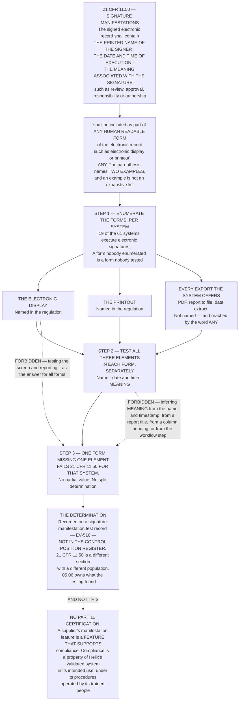

# Diagram — What "Any Human Readable Form" Reaches

| Field | Value |
|---|---|
| Version | 1.0 |
| Date | 2027-01-29 |
| Owner | Priyanka Venkataraman, Data Integrity Lead |
| Approver | Dr Marguerite Oyelaran, Vice President, Quality |
| Classification | Confidential — Helix Pharma, Inc. Data Integrity Programme // Illustrative Portfolio Sample |

*Phase 05 speaks as at **2027-01-29**. Helix Pharma and every figure drawn here are fictional and illustrative. **21 CFR Part 11 is real** and is cited in the chapters that own each step.*

---

**What this diagram shows.** It shows the structure of the test `21 CFR 11.50` requires. The regulation
asks for three elements on a signed electronic record — **the printed name of the signer**, **the date and
time when the signature was executed**, and **the meaning associated with the signature** — and requires
that they *"shall be included as part of **any human readable form** of the electronic record (such as
electronic display or printout)."* The chart draws what follows from the word *any*: the forms a system can
render are enumerated first, the three elements are checked separately in each of them, and **a
determination of *Met* is a statement about every form rather than about the one anybody demonstrates.**
It also draws the two conventional shortcuts as forbidden — testing the electronic display alone, and
inferring the meaning from the presence of the other two elements or from the title of a report. Nineteen
of the sixty-one systems execute electronic signatures, and each of them enters the enumeration on the left.
**What the testing found is `../05.06-signatures-and-the-human-readable-form.md`'s and the register's**, and
the chart draws the method rather than the result.

**What this diagram does not show.** **It shows no result.** How many of the nineteen carry all three
elements in every form, and where an element is absent, is
`../05.06-signatures-and-the-human-readable-form.md`'s, and the test records and the finding are `EV-516`
and `EV-517`. **The determination is not a column in `../logs/control-position-register.md`**, whose unit is
a paragraph of `21 CFR 11.10` on a system and whose `§6` says those determinations are deliberately not
columns there. **The three form boxes are classes of rendering, not populations with sizes**, and no system
is named anywhere in the chart.

**It states no validation outcome.** **A control assessment is not validation** — `ADR-0034`. Nothing drawn
here validates a system, and the evidence Phase 04 requires is owed in full.

**It draws no signature component requirement.** What a signature must be executed with — two distinct
identification components, and the continuing component within a single continuous period — is
`21 CFR 11.200`'s and is drawn at `05-the-continuing-component.md`. **Nothing here is multi-factor
authentication**, and `21 CFR 11.200(a)(1)` is never described as such.

**It draws no linking requirement.** `21 CFR 11.70` requires signatures to be linked so they cannot be
*"excised, copied, or otherwise transferred to falsify an electronic record by ordinary means"* and **names
no mechanism. There is no hashing requirement at `21 CFR 11.70`** and no digital-signature requirement for
a closed system.

**And it reaches no legal conclusion.** A determination that a paragraph is not met is Helix's own
assessment of its own position at a vantage — **not a violation, not a breach, not a non-compliance, not a
finding and not an inspectional observation** — and nothing here forecasts what any inspection will find.

## Cross-References

| Document | Relationship |
|---|---|
| [05.06 Signatures and the Human Readable Form](../05.06-signatures-and-the-human-readable-form.md) | **Owns `21 CFR 11.50`, the test and the result** |
| [05.07 The Continuing Component](../05.07-the-continuing-component.md) | `21 CFR 11.200`, the other signature determination |
| [05.03 The Three Determinations](../05.03-the-three-determinations.md) | **The value set, and why there is no partial value** |
| [adr/ADR-0032 `21 CFR 11.50` is tested against every human readable form](../adr/ADR-0032-11-50-is-tested-against-every-human-readable-form.md) | **The decision the three steps implement**, and the refused alternatives |
| [templates/](../templates/) | **The signature manifestation test record covering every human readable form** — an empty form |
| [logs/evidence-index.md](../logs/evidence-index.md) | **`EV-516` the test records · `EV-517` the finding** — where this determination is recorded |
| [logs/control-position-register.md](../logs/control-position-register.md) | **`§6` — a `21 CFR 11.50` determination is deliberately not a column there** |
| [diagrams/05-the-continuing-component.md](05-the-continuing-component.md) | The signature-component question this chart does not draw |
| [01.03 What Part 11 Actually Is](../../01-program-foundation-and-regulatory-scoping/01.03-what-part-11-actually-is.md) | **`§6` — Subpart C**; **`§8` — what Part 11 does not require** |
| [02.06 The Paper That Was Not the Record](../../02-the-system-inventory-and-part-11-applicability/02.06-the-paper-that-was-not-the-record.md) | **`§3` — the printout route**, a scope test and not this one |

← [diagrams/05-the-grid.md](05-the-grid.md) · [Phase 05 README](../05.00-README.md) · [diagrams/05-the-continuing-component.md](05-the-continuing-component.md) →
