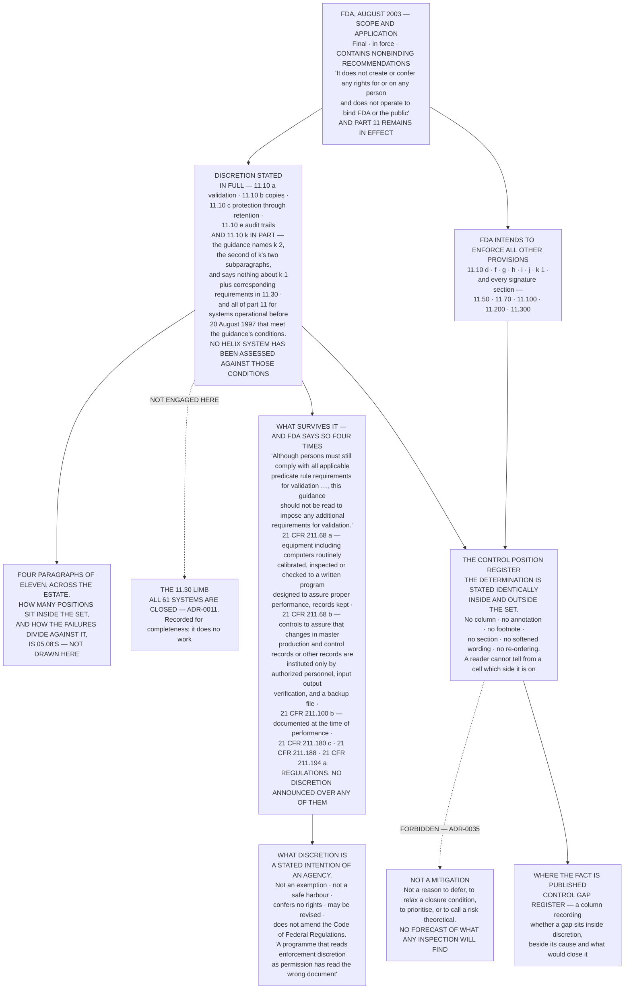

# Diagram — Inside and Outside Enforcement Discretion, and What Survives It

| Field | Value |
|---|---|
| Version | 1.0 |
| Date | 2027-01-29 |
| Owner | Terrence Abbatiello, Head of Quality Assurance |
| Approver | Gideon Halvorsen, Head of Internal Audit |
| Classification | Confidential — Helix Pharma, Inc. Data Integrity Programme // Illustrative Portfolio Sample |

*Phase 05 speaks as at **2027-01-29**. Helix Pharma and every figure drawn here are fictional and illustrative. **21 CFR Part 11, 21 CFR Part 211 and FDA's August 2003 Scope and Application guidance are real** and are cited in the chapters that own each step.*

---

**What this diagram shows.** It shows which paragraphs of `21 CFR 11.10` FDA's August 2003 guidance reaches
with its statement of enforcement discretion, what that statement is, what survives it, and **what it is not
permitted to do to a determination.** Discretion reaches **`(a)`, `(b)`, `(c)` and `(e)`, and `(k)` in
part — the guidance names `(k)(2)`, the second of `(k)`'s two subparagraphs, and says nothing about
`(k)(1)`** — plus the corresponding requirements in `21 CFR 11.30`, and, for systems operational before
20 August 1997 that meet the guidance's conditions, all Part 11 requirements. **No Helix system has been
assessed against those conditions.** FDA's own
words are that it intends to enforce *"all other provisions of part 11 including, but not limited to,
certain controls for closed systems in § 11.10"*, and of that set that *"We expect continued compliance
with these provisions, and we will continue to enforce them."* The chart draws the predicate rules standing
underneath — **`21 CFR 211.68` and `21 CFR 211.100(b)` above all**, neither the subject of any announced
discretion — and it draws the register on the right, **which records a determination identically whichever
side of the line its paragraph falls.** How the failures divide against the line is
`../05.08-the-position.md`'s.

The validation sentence the chart abbreviates is quoted here whole: *"Although persons must still comply
with all applicable predicate rule requirements for validation (e.g., 21 CFR 820.70(i)), this guidance
should not be read to impose any additional requirements for validation."* **The predicate-rule example FDA
gives is a device provision; for Helix the applicable provision is `21 CFR 211.68`.**

**What this diagram does not show.** **It shows no result and no count.** How many positions sit inside the
full-discretion set, and how the failures divide against it, is `../05.08-the-position.md`'s. **The only
population named anywhere in the chart is the sixty-one**, which is Phase 02's and is cited from `02.08`.

**It reaches no predicate-rule conclusion.** `21 CFR 211.68`, `21 CFR 211.100(b)`, `21 CFR 211.180(c)`,
`21 CFR 211.188` and `21 CFR 211.194(a)` are drawn to locate obligations in the text. **Nothing here says
Helix has met or failed any of them**, and no such conclusion is reached anywhere in this phase.

**It forecasts nothing about enforcement.** It does not say what FDA will do, will not do, or is likely to
do about any provision. **The programme will not forecast the outcome of any future FDA inspection**, and
**no entry in these registers carries a likelihood, an impact or a score.**

**It reaches no legal conclusion.** A determination of *Not met* is Helix's own assessment of its own
position at a vantage — **not a violation, not a breach, not a non-compliance, not a finding and not an
inspectional observation** — and **a Form FDA 483 is not a legal finding.**

**And it draws no legacy-system position.** The 2003 guidance also states discretion for systems operational
before 20 August 1997 that meet its stated conditions; **the limb is drawn as part of the set and no
further. No Helix system has been assessed against those conditions**, no system in the register is
described as a legacy system, and **nothing in this phase relies on it.**

## Cross-References

| Document | Relationship |
|---|---|
| [05.11 Discretion Changes Nothing](../05.11-discretion-changes-nothing.md) | **Owns the set at `§2`, what discretion is at `§3`, what survives it at `§4`, and the identity rule at `§5`** |
| [05.08 The Position](../05.08-the-position.md) | **Where the failures fall — the split this chart does not draw** |
| [05.05 Audit Trails](../05.05-audit-trails.md) | `21 CFR 11.10(e)`, whole — the paragraph most affected by the set |
| [05.04 Access](../05.04-access.md) | `(d)` and `(g)`, which sit outside it |
| [adr/ADR-0035 Discretion changes nothing about the position](../adr/ADR-0035-discretion-changes-nothing-about-the-position.md) | **The decision the register box implements**, and the refused alternatives |
| [logs/control-gap-register.md](../logs/control-gap-register.md) | **The column where the landscape fact is published** |
| [logs/control-position-register.md](../logs/control-position-register.md) | The register that carries no such column |
| [01.04 The Predicate Rules and Enforcement Discretion](../../01-program-foundation-and-regulatory-scoping/01.04-the-predicate-rules-and-enforcement-discretion.md) | **`§3` — the general argument, `ADR-0003`** |
| [04.05 The Framework](../../04-the-validation-framework-and-policy-architecture/04.05-the-framework.md) | **`§5` — evidence required for all eleven, with the discretion recorded as a fact** |
| [02.07 Open and Closed](../../02-the-system-inventory-and-part-11-applicability/02.07-open-and-closed.md) | **`§6` — all sixty-one are closed**, so the `21 CFR 11.30` limb is not engaged |

← [diagrams/05-the-continuing-component.md](05-the-continuing-component.md) · [Phase 05 README](../05.00-README.md) →
