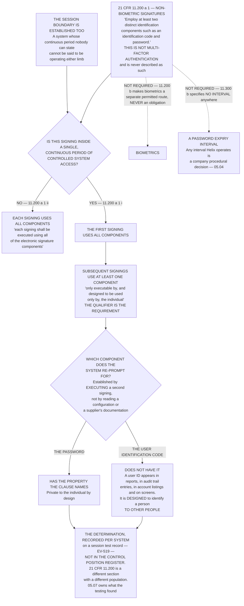

# Diagram — The Continuing Component Under `21 CFR 11.200(a)(1)(i)`

| Field | Value |
|---|---|
| Version | 1.0 |
| Date | 2027-01-29 |
| Owner | Amara Sissoko, Chief Information Officer |
| Approver | Priyanka Venkataraman, Data Integrity Lead |
| Classification | Confidential — Helix Pharma, Inc. Data Integrity Programme // Illustrative Portfolio Sample |

*Phase 05 speaks as at **2027-01-29**. Helix Pharma and every figure drawn here are fictional and illustrative. **21 CFR Part 11 is real** and is cited in the chapters that own each step.*

---

**What this diagram shows.** It shows what `21 CFR 11.200(a)(1)` asks of a non-biometric electronic
signature and how the question changes within a single, continuous period of controlled system access. The
paragraph requires that a signature *"Employ at least two distinct identification components such as an
identification code and password."* **Within a continuous period, the first signing uses all components and
subsequent signings must use at least one component that is** *"only executable by, and designed to be used
only by, the individual"*; **outside a continuous period, `21 CFR 11.200(a)(1)(ii)` requires that** *"each
signing shall be executed using all of the electronic signature components."* The chart draws the test that
follows: **the clause names a property, and the component that has it is the password, because a user
identification code appears in reports, in audit trail entries, in account listings and on screens, and is
designed to identify a person to other people.** Nineteen of the sixty-one systems execute electronic
signatures and each is tested by executing a second signing in the same session and recording which
component was demanded. **What the testing found is `../05.07-the-continuing-component.md`'s.**

**What this diagram does not show.** **It shows no result.** How many of the nineteen re-prompt for which
component is `../05.07-the-continuing-component.md`'s, and the test records and the finding are `EV-519`
and `EV-520`. **The determination is not a column in `../logs/control-position-register.md`**, whose unit is
a paragraph of `21 CFR 11.10` on a system and whose `§6` says those determinations are deliberately not
columns there. No box in the chart carries a count except the population of signature-executing systems.

**It is not a multi-factor authentication diagram.** `21 CFR 11.200(a)(1)` requires **two distinct
identification components**, which an identification code and a password satisfy. **Multi-factor
authentication is a different standard from a different tradition, and this repository never describes
`21 CFR 11.200` as an MFA requirement.**

**It draws no access control.** Getting into a system is `21 CFR 11.10(d)`'s and `21 CFR 11.300`'s and is
`../05.04-access.md`'s subject; **the clause drawn here operates on a signer who is already inside the
session**, which is why reading it as satisfied by the login empties it of content.

**It draws no signature manifestation requirement.** What a signed record must display — the printed name,
the date and time, and the meaning, in any human readable form — is `21 CFR 11.50`'s and is drawn at
`05-any-human-readable-form.md`.

**It states no validation outcome**, and **a control assessment is not validation** — `ADR-0034`. **And it
names no system, no supplier and no individual**: no document in this repository assesses any individual's
work, and none describes any product as Part 11 certified, FDA-approved or FDA-validated.

## Cross-References

| Document | Relationship |
|---|---|
| [05.07 The Continuing Component](../05.07-the-continuing-component.md) | **Owns `21 CFR 11.200`, the test and the result** |
| [05.06 Signatures and the Human Readable Form](../05.06-signatures-and-the-human-readable-form.md) | `21 CFR 11.50`, the other signature determination |
| [05.04 Access](../05.04-access.md) | **`§3`–`§4` — `21 CFR 11.300`, and that no password interval is a Part 11 requirement** |
| [05.03 The Three Determinations](../05.03-the-three-determinations.md) | The value set the determination takes |
| [adr/ADR-0033 The continuing component is the password](../adr/ADR-0033-the-continuing-component-is-the-password.md) | **The decision the test box implements**, and the refused alternatives |
| [logs/evidence-index.md](../logs/evidence-index.md) | **`EV-519` the session test records · `EV-520` the finding** — where this determination is recorded |
| [logs/control-position-register.md](../logs/control-position-register.md) | **`§6` — a `21 CFR 11.200` determination is deliberately not a column there** |
| [diagrams/05-any-human-readable-form.md](05-any-human-readable-form.md) | The manifestation question this chart does not draw |
| [01.03 What Part 11 Actually Is](../../01-program-foundation-and-regulatory-scoping/01.03-what-part-11-actually-is.md) | **`§6` — Subpart C**; **`§8` — no MFA, no biometrics, no password interval** |
| [02.07 Open and Closed](../../02-the-system-inventory-and-part-11-applicability/02.07-open-and-closed.md) | **`§6` — what a shared credential defeats is attribution** |
| [01.07 Roles, Governance and the Quality Unit](../../01-program-foundation-and-regulatory-scoping/01.07-roles-governance-and-the-quality-unit.md) | **`§6` — no individual signs on behalf of another** |

← [diagrams/05-any-human-readable-form.md](05-any-human-readable-form.md) · [Phase 05 README](../05.00-README.md) · [diagrams/05-inside-and-outside-discretion.md](05-inside-and-outside-discretion.md) →
