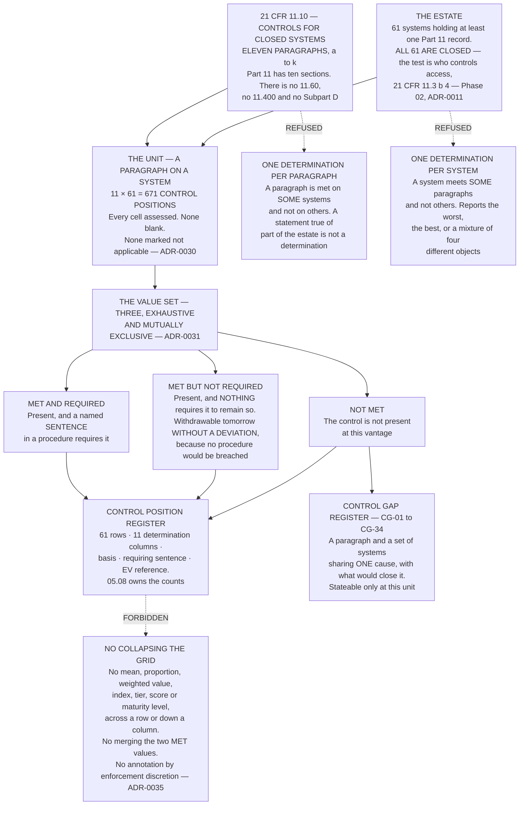

# Diagram — The Grid: A Paragraph on a System, and the Two Units That Were Refused

| Field | Value |
|---|---|
| Version | 1.0 |
| Date | 2027-01-29 |
| Owner | Colm Ó Braonáin, Computerised System Validation Lead |
| Approver | Priyanka Venkataraman, Data Integrity Lead |
| Classification | Confidential — Helix Pharma, Inc. Data Integrity Programme // Illustrative Portfolio Sample |

*Phase 05 speaks as at **2027-01-29**. Helix Pharma and every figure drawn here are fictional and illustrative. **21 CFR Part 11 and 21 CFR Part 211 are real** and are cited in the chapters that own each step.*

---

**What this diagram shows.** It shows the unit of a control position and the two coarser units that were
considered and refused. **The unit is a paragraph of `21 CFR 11.10` on a system**, and eleven paragraphs
across sixty-one systems is six hundred and seventy-one control positions, every one of which carries a
determination. The chart draws why neither coarser unit survives: **a system meets some paragraphs and not
others**, so a system-level value must report the worst, the best or a mixture; and **a paragraph is met on
some systems and not on others**, so a paragraph-level value is a statement that is true of part of the
estate and false of the rest. It also draws the value set every cell takes — three named determinations,
one of which records that a control is present and that nothing requires it to remain so — and the two
places a determination goes afterwards: the control position register, and, where the value is *Not met*,
a control gap that names a paragraph and a set of systems sharing one cause. **The arrows into the
prohibited box are the operations the method forbids on the grid once it exists.**

**What this diagram does not show.** **It shows no result.** How the six hundred and seventy-one
determinations fall across the three values is `../05.08-the-position.md`'s and
`../logs/control-position-register.md`'s, and nothing in the chart carries a count of anything except the
population itself. The three value boxes are three definitions, not three sizes.

**It states no validation outcome and is not a validation status.** **A control assessment is not
validation, and neither substitutes for the other** — `ADR-0034`, `../05.01-what-a-control-position-is.md §4`.
No system is validated by anything drawn here, no package has been executed, no protocol has been run and
no test result exists; the evidence Phase 04 requires is owed in full.

**It is not a scoring instrument and not a maturity model.** The three values are named and are never
converted into numbers. **Nothing in regulation or guidance requires a data integrity maturity model, score,
rating or scale**, and this repository publishes none.

**It is not a map of ALCOA onto `21 CFR 11.10`.** No column of the register is an attribute; FDA's only
published mapping of the five attributes is footnote 5, which cites the CGMP predicate rules and cites Part
11 nowhere — `ADR-0019`.

**And it names no system, no record type and no pair.** The sixty-one are Phase 02's population, cited from
`02.08` and not re-derived, and no `CG` identifier drawn here is described differently from the register
that allocates it.

## Cross-References

| Document | Relationship |
|---|---|
| [05.02 The Grid](../05.02-the-grid.md) | **Owns the unit at `§2`, the two refusals at `§3` and `§4`, and the prohibition at `§6`** |
| [05.03 The Three Determinations](../05.03-the-three-determinations.md) | **Owns the value set at `§2`, and the middle value at `§4`** |
| [05.01 What a Control Position Is](../05.01-what-a-control-position-is.md) | `§2` — what a cell carries; `§4` — why it is not validation |
| [05.08 The Position](../05.08-the-position.md) | **The counts this chart does not draw** |
| [adr/ADR-0030 The unit is a paragraph on a system](../adr/ADR-0030-the-unit-is-a-paragraph-on-a-system.md) | **The decision the unit box implements**, and the refused alternatives |
| [adr/ADR-0031 Met but not required is a determination](../adr/ADR-0031-met-but-not-required-is-a-determination.md) | Why the value set has three members |
| [logs/control-gap-register.md](../logs/control-gap-register.md) | `CG-01` to `CG-34` |
| [04.05 The Framework](../../04-the-validation-framework-and-policy-architecture/04.05-the-framework.md) | **`§5` — the eleven-paragraph evidence set**; `§6` rule 7 — a graduation moves depth and removes no paragraph |
| [02.07 Open and Closed](../../02-the-system-inventory-and-part-11-applicability/02.07-open-and-closed.md) | **`§6` — all sixty-one are closed** |
| [01.03 What Part 11 Actually Is](../../01-program-foundation-and-regulatory-scoping/01.03-what-part-11-actually-is.md) | **`§1` — ten sections**; **`§5` — the eleven paragraphs** |

← [Phase 05 README](../05.00-README.md) · [diagrams/05-any-human-readable-form.md](05-any-human-readable-form.md) →
