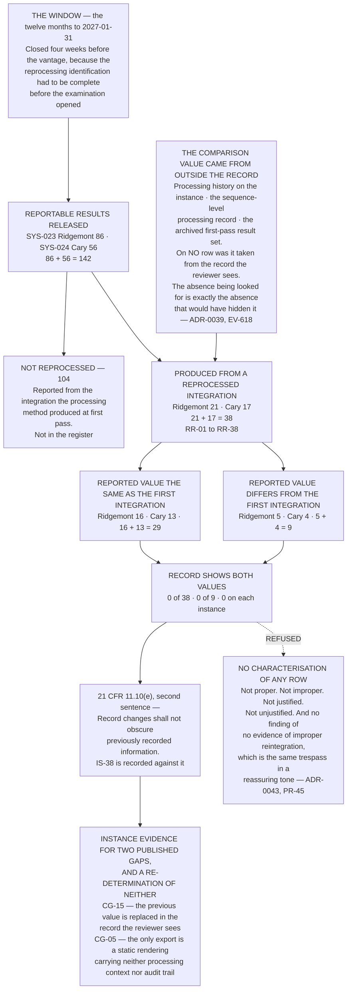

# Diagram — One Hundred and Forty-Two, and the Zero at the End of It

| Field | Value |
|---|---|
| Version | 1.0 |
| Date | 2027-02-26 |
| Owner | Dr Sunita Raghunathan, Head of Quality Control |
| Approver | Terrence Abbatiello, Head of Quality Assurance |
| Classification | Confidential — Helix Pharma, Inc. Data Integrity Programme // Illustrative Portfolio Sample |

*Phase 06 speaks as at **2027-02-26**. Helix Pharma and every figure drawn here are fictional and illustrative. **21 CFR Part 11 and 21 CFR Part 211 are real** and are cited in the chapters that own each step.*

---

**What this diagram shows.** It shows the reprocessing examination as a funnel, with each stage split by
instance because the two instances are assessed separately and never as one object — `ADR-0037`. **In the
twelve months to 2027-01-31, 142 reportable results were released across the two systems — Ridgemont 86
and Cary 56. 38 of the 142 were produced from a reprocessed integration — 21 and 17. 9 of the 38 carry a
reported value that differs from the value the first integration produced — 5 and 4. And on none of the 38,
so on none of the 9, does the record a reviewer opens show both values.** The chart also draws the thing
that makes the last stage testable: **the value the first integration produced was obtained from outside
the record the reviewer sees**, because a method that consults the record to answer the question cannot
return a negative. Every count drawn here is computed from the rows of
`../logs/reintegration-register.md §2` and reconciled at `EV-619`; the provenance of the comparison values
is at `EV-618`.

**What this diagram does not show.** **It characterises none of the thirty-eight and none of the nine.**
**No reintegration examined in this phase is characterised as proper, improper, justified or unjustified**
— `ADR-0043`, `DEC-617`. The reassuring converse is refused with the accusing one: *the examination found
no evidence of improper reintegration* is literally true of a record that could not have shown such
evidence either way, **it reads as an assurance, and it discourages anybody from testing it.** **A record
that shows one value cannot distinguish a justified reintegration from an unjustified one**, and that is
why the box exists and why nothing is drawn beyond it.

**It says nothing about whether any of the 142 results was correct.** **Batch disposition sits with the
quality unit whatever state this programme is in** — `21 CFR 211.22` — and no release is revisited by
anything drawn here. **The nine differ from the first integration; the chart does not say that any of the
nine is wrong.**

**It says nothing about anybody's conduct.** **No document in this repository assesses any individual's
work.** Reprocessing is an ordinary and often necessary part of chromatographic analysis, and the finding
is about what the record retains.

**It shows no reason-for-change position.** Twelve of the thirty-eight carry a reason in the
reason-for-change field, four in a comment on the injection, six in a bound notebook, three in the LIMS,
and thirteen nowhere — and **none of that is compliance with `21 CFR 11.10(e)`, which requires something
else.** **Part 11 imposes no reason-for-change requirement** — `ADR-0036` — and
`../06.07-reintegration.md §4` names the three provisions that do speak to reasons, none of them
`21 CFR 11.10(e)`.

**It states no retention, backup or archive rule.** The material the comparison was made against is held
somewhere, and **for how long, in what form, and whether the copy that survives is a true one is Phase
07's** — `IS-42`. `21 CFR 11.10(e)` requires audit trail documentation to be retained *"for a period at
least as long as that required for the subject electronic records"*, **and no such period exists for any
of the thirty-four in-scope record types** — `IS-14`.

**It closes, re-scopes and re-determines nothing.** `CG-15` and `CG-05` are evidenced here and stand
exactly as `../../05-access-audit-trails-and-electronic-signatures/logs/control-gap-register.md` published
them. `21 CFR 11.10(e)` is Not met on both systems before and after. **`ND-05` and `ND-10` — `RT-13`,
undetermined on all five attributes on both instances — are not determined by any of these thirty-eight
rows.**

**And it is not an estate finding.** **Two of sixty-one systems were examined this way, and the method
does not scale to the other fifty-nine** — `IS-41`, `ADR-0040`. **No percentage appears anywhere in this
phase**, and no proportion drawn from thirty-eight rows may be applied to anything.

## Cross-References

| Document | Relationship |
|---|---|
| [06.07 Reintegration](../06.07-reintegration.md) | **Owns the funnel at `§2`, `21 CFR 11.10(e)` quoted whole at `§3`, and the refusal at `§6`** |
| [06.02 One Name Is Not One System](../06.02-one-name-is-not-one-system.md) | **Owns why every stage is split** — `ADR-0037` |
| [06.05 The Audit Trail as Configured](../06.05-the-audit-trail-as-configured.md) | **`AE-08`, and why no audit trail entry accompanies the change at review time** |
| [06.10 What Else Holds These Records](../06.10-what-else-holds-these-records.md) | Where some of the comparison material lives, and `IS-40` |
| [06.13 Phase Summary and Transition](../06.13-phase-summary-and-transition.md) | **`§7` — `IS-42`, the question this chart ends at** |
| [logs/reintegration-register.md](../logs/reintegration-register.md) | **`RR-01` to `RR-38`, and every count drawn here** |
| [diagrams/06-the-acts-that-change-a-result.md](06-the-acts-that-change-a-result.md) | The eleven, and the three recorded on neither |
| [05.05 Audit Trails](../../05-access-audit-trails-and-electronic-signatures/05.05-audit-trails.md) | **`21 CFR 11.10(e)` read clause by clause** |
| [05.10 The Inversion](../../05-access-audit-trails-and-electronic-signatures/05.10-the-inversion.md) | **Owns the reason-for-change argument** — `ADR-0036` |
| [05 control-gap-register.md](../../05-access-audit-trails-and-electronic-signatures/logs/control-gap-register.md) | **`CG-15` and `CG-05`, evidenced and re-determined nowhere** |
| [02.06 The Paper That Was Not the Record](../../02-the-system-inventory-and-part-11-applicability/02.06-the-paper-that-was-not-the-record.md) | Why `RT-13` and `RT-15` are in scope |

---

← [diagrams/06-the-acts-that-change-a-result.md](06-the-acts-that-change-a-result.md) · [Phase 06 README](../06.00-README.md) · [diagrams/06-the-two-instances.md](06-the-two-instances.md) →
