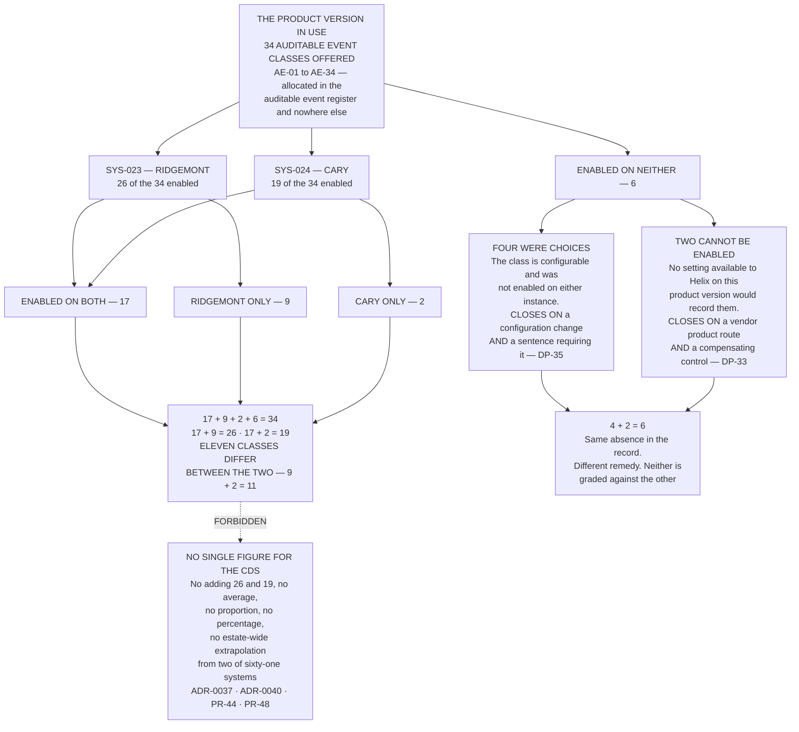

# Diagram — Thirty-Four Event Classes, and the Four Groups They Fall Into

| Field | Value |
|---|---|
| Version | 1.0 |
| Date | 2027-02-26 |
| Owner | Joachim Reuter, Head of Automation and Manufacturing IT |
| Approver | Priyanka Venkataraman, Data Integrity Lead |
| Classification | Confidential — Helix Pharma, Inc. Data Integrity Programme // Illustrative Portfolio Sample |

*Phase 06 speaks as at **2027-02-26**. Helix Pharma and every figure drawn here are fictional and illustrative. **21 CFR Part 11 and 21 CFR Part 211 are real** and are cited in the chapters that own each step.*

---

**What this diagram shows.** It shows the partition of the thirty-four auditable event classes the product
version in use offers, taken across the two instances separately. Seventeen classes are enabled on both
`SYS-023` at Ridgemont and `SYS-024` at Cary; nine are enabled at Ridgemont only; two are enabled at Cary
only; six are enabled on neither. **17 + 9 + 2 + 6 = 34.** Reading the same rows by instance gives
**26 enabled at Ridgemont and 19 at Cary**, and those two totals are drawn as two separate figures because
they are two separate configurations of one product — `ADR-0037`. The chart also splits the six that are
enabled on neither by the question that decides how each closes: **four were choices Helix made and did
not revisit; two cannot be enabled by any setting available to Helix on this product version.** **4 + 2 =
6.** Every count drawn here is computed from the rows of `../logs/auditable-event-register.md §3` and is
reconciled at `EV-613`.

**What this diagram does not show.** **It does not show which classes record an act capable of changing a
reportable result.** That cut is the one the phase turns on and it is drawn separately, at
`06-the-acts-that-change-a-result.md`; nothing in the boxes above distinguishes a class that records an
acquisition start from a class that records a baseline being moved by hand. **A partition by enablement is
not a partition by consequence**, and reading this chart alone would suggest that twenty-six of
thirty-four at Ridgemont is a fuller record than it is.

**It states no control determination.** **`21 CFR 11.10(e)` is Not met on both systems** in
`../../05-access-audit-trails-and-electronic-signatures/logs/control-position-register.md`, it was Not met
before this configuration was read and it is Not met after it. **A configuration read is not a control
determination** and no cell in that register moves because of anything drawn here.

**It states no validation outcome.** **Reading a configuration is not validating a system** — `ADR-0034`,
`IS-34`. A class drawn as enabled is a class observed to be generating entries on 2027-02-10; **it is not
a class demonstrated to record every instance of the act it names**, and no package has been executed
against either system.

**It draws no conclusion about `OBS-2`.** The observation stands exactly as written; **its subject matter
is what this phase establishes and its disposition is Phase 08's** — `ADR-0041`. Nothing here softens,
qualifies, mitigates, reduces or extends it, and **nothing here excuses a review that did not happen.**

**It is not an estate finding.** **Two of sixty-one systems were assessed at a depth not available for the
other fifty-nine** — `IS-41`, `ADR-0040`. Whether any other system in Helix's estate offers a class it
cannot enable is unknown, and this chart says neither that one does nor that none does.

**And it is not dated for ever.** Every box speaks as at 2027-02-26 and describes a configuration read on
2027-02-10 — `AS-41`. **Neither instance records a change to its own audit trail configuration**, so if
either has moved since, nothing on either system would have recorded the move.

## Cross-References

| Document | Relationship |
|---|---|
| [06.05 The Audit Trail as Configured](../06.05-the-audit-trail-as-configured.md) | **Owns the partition at `§2`, and the four-and-two at `§4`** |
| [06.04 The Acts That Change a Result](../06.04-the-acts-that-change-a-result.md) | **Owns the method, and the cut this chart does not draw** — `ADR-0038` |
| [06.02 One Name Is Not One System](../06.02-one-name-is-not-one-system.md) | **Owns why 26 and 19 are never added** — `ADR-0037` |
| [06.01 Depth and What It Costs](../06.01-depth-and-what-it-costs.md) | **Owns why this is not an estate finding** — `ADR-0040` |
| [06.06 What Review Would Not Have Found](../06.06-what-review-would-not-have-found.md) | What follows from the six, and `IS-36` |
| [logs/auditable-event-register.md](../logs/auditable-event-register.md) | **`AE-01` to `AE-34`, and every count drawn here** |
| [diagrams/06-the-acts-that-change-a-result.md](06-the-acts-that-change-a-result.md) | The cut this chart deliberately omits |
| [diagrams/06-the-two-instances.md](06-the-two-instances.md) | The nine and the two, among the four disagreements |
| [05.05 Audit Trails](../../05-access-audit-trails-and-electronic-signatures/05.05-audit-trails.md) | **`21 CFR 11.10(e)` read clause by clause** |
| [05 control-position-register.md](../../05-access-audit-trails-and-electronic-signatures/logs/control-position-register.md) | The `(e)` cells nothing here moves |

---

← [Phase 06 README](../06.00-README.md) · [diagrams/06-the-acts-that-change-a-result.md](06-the-acts-that-change-a-result.md) →
