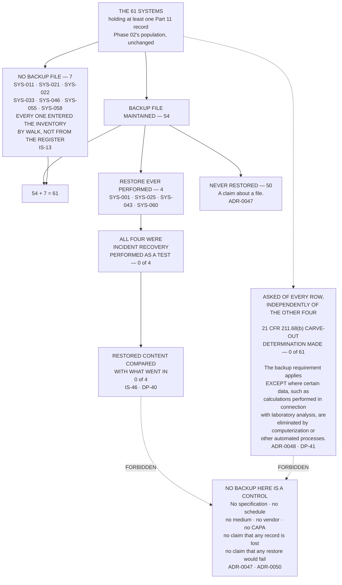

# Diagram — Sixty-One, Fifty-Four, Four, Zero

| Field | Value |
|---|---|
| Version | 1.0 |
| Date | 2027-03-19 |
| Owner | Amara Sissoko, Chief Information Officer |
| Approver | Colm Ó Braonáin, Computerised System Validation Lead |
| Classification | Confidential — Helix Pharma, Inc. Data Integrity Programme // Illustrative Portfolio Sample |

*Phase 07 speaks as at **2027-03-19**. Helix Pharma and every figure drawn here are fictional and illustrative. **21 CFR Part 11 and 21 CFR Part 211 are real** and are cited in the chapters that own each step.*

---

**What this diagram shows.** It shows the four questions
`../logs/backup-and-restore-register.md` asks of each of the 61 systems, drawn as the funnel they produce.
**A backup file is maintained on 54 of the 61 and 7 have none; 54 + 7 = 61.** **A restore has been
performed on 4**, and each of the four was incident recovery — a failed upgrade, a storage array, a
database corruption, a volume — rather than a test; **0 of the 4 were tests.** **On 0 of the 4 was the
restored content compared with what went in.** The chart draws a fifth box off to one side because it is
not part of the funnel and must not be read as its last stage: **on 0 of the 61 has Helix determined
whether `21 CFR 211.68(b)`'s backup carve-out reaches any of its data**, and that question is asked
independently of the other four. Every count drawn here is computed from the rows of
`../logs/backup-and-restore-register.md §1` and reconciled at `EV-718`.

**What this diagram does not show.** **It does not show that fifty systems are at risk, or that fifty-four
backup files would work.** The funnel narrows because fewer systems have been through each successive
event, not because anything has been found wrong with the ones that dropped out. **A backup file whose
readability, completeness and correspondence to the record it was taken from have never been established
is a claim about a file** — and that is all the 54 box says. **No box on this chart asserts that any record
has been lost, that any backup is unreadable, or that any restore would fail.**

**The fifth box is not the end of the funnel and is drawn apart on purpose.** `21 CFR 211.68(b)`'s backup
requirement is **conditional**, and until the determination is made **neither a Yes nor a No in the first
column can be read as compliance or as failure on any system.** A system with a backup file has satisfied
one limb without establishing that the limb applies; a system without one has not thereby failed the
paragraph. **The zero in that box is the reason the other four counts cannot be scored.**

**It shows nothing about the 7 that is a criticism of any owner.** Every one of the seven entered the
inventory by walking the site, and **that is a statement about what the IT register covered** — `IS-13`,
`ADR-0009`. **Nothing here says any of the seven ought to have a backup file**, because the condition has
not been determined for them either.

**It states no control determination.** `21 CFR 11.10(b)`, `(c)` and `(e)` on all 61 systems stand exactly
as Phase 05 published them — `ADR-0049` — and no cell moves because of anything drawn here. **A backup
arrangement is not a control position and neither is a restore.**

**It states no validation outcome.** **Reading a backup arrangement is not validating a system**, and
`21 CFR 211.68` imposes no general computerised-system validation requirement — the word *validation*
appears in the section once, inside the carve-out drawn in the fifth box. **The evidence Phase 04 requires
is owed in full** — `IS-34`.

**It sets no retention period, for a backup set or for anything else.** **A backup inherits the question
the record it copies has not answered**, and fourteen record types have no period set by any predicate
rule — `../logs/retention-derivation-register.md`.

**And it is not dated for ever.** Every box speaks as at 2027-03-19 and rests on `AS-49` and `AS-50`:
**no cell of the register was taken from a system.** Each was taken from an enquiry answered by the people
who operate it, and the four restores are the whole of the restore history only so far as Helix's own
records reach.

## Cross-References

| Document | Relationship |
|---|---|
| [07.07 Backup Is Not Restore](../07.07-backup-is-not-restore.md) | **Owns the four numbers at `§1`, the provision at `§2` and the four restores at `§4`** |
| [07.05 The Retention Estate](../07.05-the-retention-estate.md) | `SYS-060` in the funnel, and the three others |
| [logs/backup-and-restore-register.md](../logs/backup-and-restore-register.md) | **`BR-01` to `BR-61`, and every count drawn here** |
| [logs/raid-log.md](../logs/raid-log.md) | **`IS-46`**, `DP-40`, `DP-41`, `AS-49`, `AS-50`, `PR-53` |
| [governance/GOV-33](../governance/GOV-33-the-backup-and-restore-position.md) | The sitting at which these counts were accepted |
| [05 control-position-register.md](../../05-access-audit-trails-and-electronic-signatures/logs/control-position-register.md) | The cells nothing here moves |
| [06 06.13 Phase Summary and Transition](../../06-the-chromatography-data-system/06.13-phase-summary-and-transition.md) | **`§7` — the carve-out determination recorded as owed** |

---

← [diagrams/07-what-sets-the-period.md](07-what-sets-the-period.md) · [Phase 07 README](../07.00-README.md) · [diagrams/07-the-paper-that-left-part-11.md](07-the-paper-that-left-part-11.md) →
