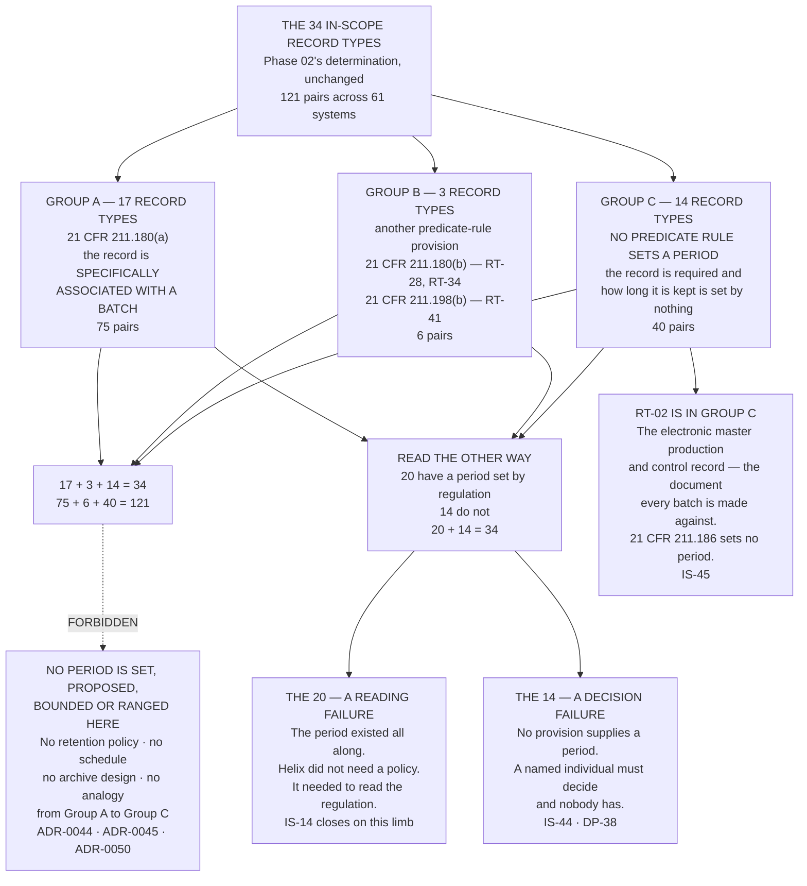

# Diagram — The Derivation: Thirty-Four Record Types, Three Groups, and the Pairs They Account For

| Field | Value |
|---|---|
| Version | 1.0 |
| Date | 2027-03-19 |
| Owner | Priyanka Venkataraman, Data Integrity Lead |
| Approver | Terrence Abbatiello, Head of Quality Assurance |
| Classification | Confidential — Helix Pharma, Inc. Data Integrity Programme // Illustrative Portfolio Sample |

*Phase 07 speaks as at **2027-03-19**. Helix Pharma and every figure drawn here are fictional and illustrative. **21 CFR Part 11 and 21 CFR Part 211 are real** and are cited in the chapters that own each step.*

---

**What this diagram shows.** It shows the retention derivation as it comes out: the 34 record types Phase
02 determined to be Part 11 records, partitioned by the provision that sets a retention period for each,
and the same partition recomputed at pair level from the systems each record type is held on. **Seventeen
record types take their period from `21 CFR 211.180(a)` because the record is specifically associated with
a batch. Three take it from another predicate-rule provision — `21 CFR 211.180(b)` for two of them and
`21 CFR 211.198(b)` for the third. Fourteen take it from nothing at all. 17 + 3 + 14 = 34.** Read across
the systems column of `../logs/retention-derivation-register.md`, the same three groups account for
**75, 6 and 40 pairs, and 75 + 6 + 40 = 121 — Phase 03's own 121 pairs, partitioned and not recounted.**
The chart also draws the shorter reading the committee took at `GOV-32`: **20 of the 34 have a period set
by regulation and 14 do not.** Every count drawn here is computed from the rows of
`../logs/retention-derivation-register.md §1` and reconciled at `EV-708`.

**What this diagram does not show.** **It does not show whether any period drawn here is operated on any
system.** A Group A box records what `21 CFR 211.180(a)` requires; it records nothing about whether Helix
retains the record for that period, whether anybody is accountable for doing so, or whether the record
could be produced at the end of it. **A period is not an arrangement** — `PR-50`, and `IS-46`, `IS-47` and
`IS-48` are three separate accounts of what would have to be true.

**It draws no order between the three groups.** A, B and C are three positions and never a grading. **The
`RT-02` box is drawn hanging off Group C rather than beside it** precisely so that nobody reads the group
as a residue: the document that defines how Helix's products are made is in it.

**It shows nothing about the fourteen reasons.** The reason no provision reaches `RT-02` is not the reason
none reaches `RT-42`, and neither is the reason none reaches `RT-27`. **Fourteen record types, fourteen
distinct reasons**, and they are at `../logs/retention-derivation-register.md §2` one at a time.

**It states no attribute determination.** The pair counts drawn here are counts of pairs by retention
group. **They are unrelated to anything Phase 03 published about *"original or a true copy"* or about any
other attribute**, they were computed from Phase 02's systems column and not from Phase 03's register, and
`../07.11-original-or-a-true-copy-on-the-cgmp-side.md` is the only document in this phase that reads a
retention figure and an attribute figure together. **Nothing on this chart is a data integrity position.**

**It states no control determination.** `21 CFR 11.10(c)` and `(e)` on all 61 systems stand exactly as
Phase 05 published them — `ADR-0049` — and no cell moves because of anything drawn here. **What Group C
does to those two paragraphs is at `../07.08-the-endpoint-that-does-not-exist.md` and
`../07.09-a-relation-with-two-terms.md`, and neither re-determines anything.**

**It says nothing about the four record types on the printout route.** `RT-09`, `RT-22`, `RT-23` and
`RT-29` are not Part 11 records, are not among the 34, and are not on this chart. **The route holds for all
four** and their Part 211 position is at `../logs/paper-record-register.md`.

**And it is not dated for ever.** Every box speaks as at 2027-03-19 and rests on `AS-47` — that the
predicate-rule anchors Phase 02 published are the whole of what makes each of the 34 a required record.
**If a provision nobody cited reaches one of the fourteen, the partition moves.**

## Cross-References

| Document | Relationship |
|---|---|
| [07.03 The Derivation](../07.03-the-derivation.md) | **Owns the partition at `§2` and the reconciliation at `§3`** |
| [07.02 Specifically Associated With a Batch](../07.02-specifically-associated-with-a-batch.md) | **Owns `21 CFR 211.180` read whole** — `ADR-0045` |
| [07.01 A Period Is Derived, Not Chosen](../07.01-a-period-is-derived-not-chosen.md) | **Owns why nothing here is chosen** — `ADR-0044` |
| [07.04 What Nothing Sets](../07.04-what-nothing-sets.md) | **Owns the fourteen and the `IS-14` split** |
| [logs/retention-derivation-register.md](../logs/retention-derivation-register.md) | **`RD-01` to `RD-34`, and every count drawn here** |
| [diagrams/07-what-sets-the-period.md](07-what-sets-the-period.md) | The provisions themselves, and the gap where none does |
| [03 attribute-determination-register.md](../../03-data-integrity-risk-assessment-and-the-alcoa-attributes/logs/attribute-determination-register.md) | The 121 pairs this chart partitions and does not recount |

---

← [Phase 07 README](../07.00-README.md) · [diagrams/07-what-sets-the-period.md](07-what-sets-the-period.md) →
