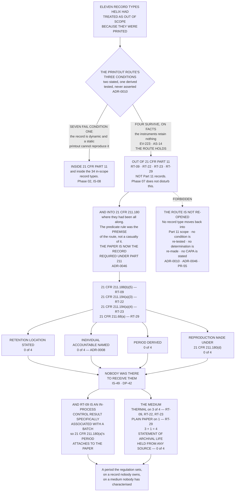

# Diagram — The Paper That Left Part 11, and What Was Waiting on the Other Side

| Field | Value |
|---|---|
| Version | 1.0 |
| Date | 2027-03-19 |
| Owner | Dr Sunita Raghunathan, Head of Quality Control |
| Approver | Priyanka Venkataraman, Data Integrity Lead |
| Classification | Confidential — Helix Pharma, Inc. Data Integrity Programme // Illustrative Portfolio Sample |

*Phase 07 speaks as at **2027-03-19**. Helix Pharma and every figure drawn here are fictional and illustrative. **21 CFR Part 11 and 21 CFR Part 211 are real** and are cited in the chapters that own each step.*

---

**What this diagram shows.** It shows the route four record types took out of `21 CFR Part 11` and where
they arrived. **Phase 02 tested eleven record types against the printout route's three conditions — two
FDA states expressly and a third Helix derives from the narrow interpretation's second category. Seven
failed the first condition. Four survived, on facts, and the route holds for all four.** The chart draws
that determination as a door the four went through, and then draws what is on the other side: **the
predicate rules that made them required records in the first place, and `21 CFR 211.180`, under which the
paper is now the record required by Part 211.** The four boxes at the foot are the four questions
`../logs/paper-record-register.md` asks on arrival, **and the answer to each is the same on all four
record types.** Every count drawn here is computed from the rows of `../logs/paper-record-register.md §1`.

**What this diagram does not show.** **It does not show a failure of Phase 02's determination, and no arrow
on it points backwards through the door.** The four survived a test that was applied to eleven, evidenced
instrument by instrument during the walk of the estate, and **the route holds for all four.** The
*forbidden* box is drawn off the `OUT` node rather than at the foot of the chart because that is where the
misreading starts — `PR-55`.

**It does not show a Part 11 obligation attaching to any of the four.** `21 CFR 11.10(b)`, `(c)` and `(e)`
do not reach them, none of them is in the 34 in-scope record types, none is in the 121 pairs, and none is
held on any of the 61 systems. **The instruments behind them — `SYS-062` to `SYS-068` — are inside Phase
02's 35 and outside the 61.**

**It makes no claim about the durability of thermal print.** The medium box records a fact about the paper
and a fact about what Helix holds. **It does not say that thermal print fades, that any ticket has faded,
or that any of the four is at risk** — every one of those would be a claim about a property nobody has
established, which is the finding itself with the sign reversed. **The absence of a statement is what is
drawn.**

**It shows no condition of any actual record.** No ticket, worksheet or certificate was inspected in this
phase. **Unassessed is not adverse.**

**It draws `RT-29` on the same path as the other three and the difference is not in the chart.**
`RT-09` lacks an arrangement for a period the regulation has already set; `RT-22`, `RT-23` and `RT-29` lack
the arrangement and the determination both, and **`RT-29`'s plain-paper medium raises a different set of
questions rather than none.** `../logs/paper-record-register.md §2` carries that and this chart flattens
it.

**And it is not dated for ever.** Every box rests on `AS-14` and `AS-52`: that the instruments behind the
four retain no retrievable record and have no export. **Replace a bench meter with a model that logs to a
network share and `RT-23`'s third condition ends the day it is installed, without anybody deciding
anything** — `PR-16`, and `ADR-0015`'s review trigger is the mechanism that is supposed to catch it.
**`SOP-DI-05` has still not fired on any change.**

## Cross-References

| Document | Relationship |
|---|---|
| [07.10 The Paper Question](../07.10-the-paper-question.md) | **Owns the route at `§1`, the inversion at `§2`, the counts at `§3`, the medium at `§4` and `RT-09` at `§5`** |
| [07.02 Specifically Associated With a Batch](../07.02-specifically-associated-with-a-batch.md) | **Owns `21 CFR 211.180` read whole** |
| [07.11 Original or a True Copy on the CGMP Side](../07.11-original-or-a-true-copy-on-the-cgmp-side.md) | **Owns `21 CFR 211.180(d)`, the permission in the fourth question** |
| [logs/paper-record-register.md](../logs/paper-record-register.md) | **`PP-01` to `PP-04`, and every count drawn here** |
| [logs/raid-log.md](../logs/raid-log.md) | **`IS-49`**, `DP-42`, `PR-55`, `AS-14`, `AS-52`, `PR-16` |
| [governance/GOV-34](../governance/GOV-34-the-paper-records-position.md) | The sitting at which these counts were accepted |
| [02 02.06 The Paper That Was Not the Record](../../02-the-system-inventory-and-part-11-applicability/02.06-the-paper-that-was-not-the-record.md) | **`§7` — the four that survive. The determination this chart does not disturb** |
| [02 systems-register.md](../../02-the-system-inventory-and-part-11-applicability/logs/systems-register.md) | **`§2` — `SYS-062` to `SYS-068`** |

---

← [diagrams/07-backup-restore-verify.md](07-backup-restore-verify.md) · [Phase 07 README](../07.00-README.md) →
