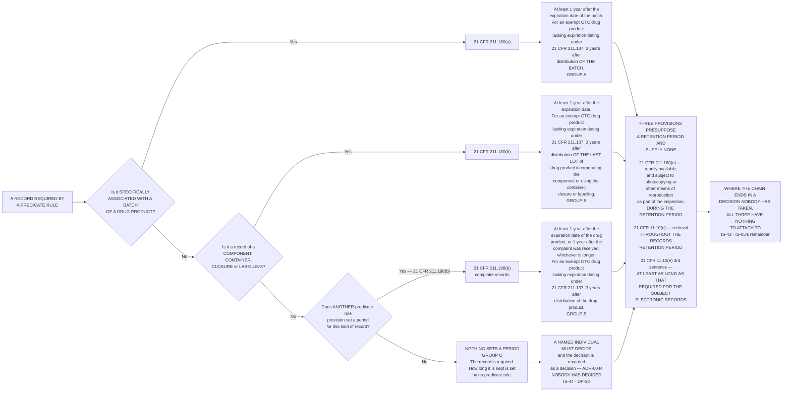

# Diagram — What Sets the Period, and the Gap Where Nothing Does

| Field | Value |
|---|---|
| Version | 1.0 |
| Date | 2027-03-19 |
| Owner | Priyanka Venkataraman, Data Integrity Lead |
| Approver | Dr Marguerite Oyelaran, Vice President, Quality |
| Classification | Confidential — Helix Pharma, Inc. Data Integrity Programme // Illustrative Portfolio Sample |

*Phase 07 speaks as at **2027-03-19**. Helix Pharma and every figure drawn here are fictional and illustrative. **21 CFR Part 11 and 21 CFR Part 211 are real** and are cited in the chapters that own each step.*

---

**What this diagram shows.** It shows which provision sets which period, and where the chain runs out. The
left-hand column is the question asked of each record type; the middle column is the provision that answers
it; the right-hand column is the period as the provision expresses it. **Three provisions supply a period
between them** — `21 CFR 211.180(a)` for records specifically associated with a batch of a drug product,
`21 CFR 211.180(b)` for records of components, containers, closures and labelling, and `21 CFR 211.198(b)`
for complaint records. **The fourth path is the one that matters: a record required by a predicate rule
that none of the three reaches, where the chain ends in a decision nobody has taken.** The chart also
draws the three provisions that **presuppose** a retention period without supplying one —
`21 CFR 211.180(c)`, `21 CFR 11.10(c)` and `21 CFR 11.10(e)`'s third sentence — because they are what the
gap is felt through. Which record type takes which path is at `../logs/retention-derivation-register.md §1`.

**What this diagram does not show.** **It does not show the fourteen reasons.** The chart's bottom-left
box says *nothing sets a period*; it does not say why nothing does, and the why is different for every one
of the fourteen. A cleaning log spans batches. A specification is superseded by version. A trend record
exists through shutdowns when there is no batch at all. **`../logs/retention-derivation-register.md §2`
carries them one at a time and this chart deliberately flattens them.**

**It is not a decision tree anybody may run.** It is a drawing of a derivation that has already been
performed, on a population that is fixed, by a method authorised at `GOV-31` before the first record type
was read. **Applying the shape to a record type outside the 34 would be making a determination**, and the
determination of what is in scope is Phase 02's — `ADR-0013`, `ADR-0015`.

**It shows no Helix period anywhere.** Every period drawn in the right-hand column is the regulation's,
quoted or expressed in the provision's own terms. **No period on this chart was chosen by Helix, and the
Group C box contains no figure, no range, no floor and no ceiling** — `ADR-0044`, `ADR-0050`. **A blank
invites completion**, which is why the box says what it says rather than nothing.

**It says nothing about `21 CFR Part 11` setting a period.** The three provisions in the *presuppose* box
include two from Part 11, **and neither sets a period of its own.** `21 CFR 11.10(c)` runs to the records
retention period; `21 CFR 11.10(e)`'s third sentence sets a relation whose second term is the record's
period. **Part 11 sets requirements about how long, relative to something else; the something else always
comes from the predicate rule.**

**It draws no arrangement.** No storage platform, no archive, no backup, no medium and no location appears
anywhere on it. Where the records actually sit is `../07.05-the-retention-estate.md`'s and
`../07.06-where-the-records-are-and-where-the-activity-was.md`'s; whether anything could be got back is
`../07.07-backup-is-not-restore.md`'s.

**And it makes no claim about compliance.** A record type on the Group A path is a record type whose period
the regulation states. **It is not a record type Helix is demonstrably retaining for that period**, and no
box on this chart asserts that anything is met, satisfied or discharged.

## Cross-References

| Document | Relationship |
|---|---|
| [07.02 Specifically Associated With a Batch](../07.02-specifically-associated-with-a-batch.md) | **Owns `21 CFR 211.180` read whole, paragraph by paragraph** — `ADR-0045` |
| [07.01 A Period Is Derived, Not Chosen](../07.01-a-period-is-derived-not-chosen.md) | **Owns the method and the decision route at the bottom** — `ADR-0044` |
| [07.04 What Nothing Sets](../07.04-what-nothing-sets.md) | **Owns the fourteen** — `IS-44`, `IS-45` |
| [07.08 The Endpoint That Does Not Exist](../07.08-the-endpoint-that-does-not-exist.md) | **`21 CFR 11.10(c)` with nothing to attach to** — `IS-43` |
| [07.09 A Relation With Two Terms](../07.09-a-relation-with-two-terms.md) | **`21 CFR 11.10(e)`'s second term** |
| [logs/retention-derivation-register.md](../logs/retention-derivation-register.md) | **Which record type takes which path, and why** |
| [diagrams/07-the-derivation.md](07-the-derivation.md) | The partition this chart produces, drawn as counts |

---

← [diagrams/07-the-derivation.md](07-the-derivation.md) · [Phase 07 README](../07.00-README.md) · [diagrams/07-backup-restore-verify.md](07-backup-restore-verify.md) →
