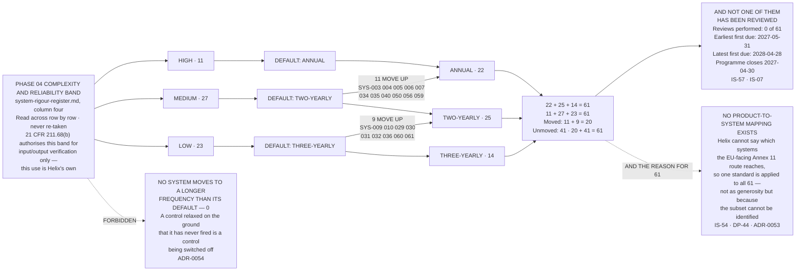

# Diagram — The Review Frequencies: 11 / 27 / 23 to 22 / 25 / 14, and the Twenty That Move

| Field | Value |
|---|---|
| Version | 1.0 |
| Date | 2027-04-09 |
| Owner | Colm Ó Braonáin, Computerised System Validation Lead |
| Approver | Dr Marguerite Oyelaran, Vice President, Quality |
| Classification | Confidential — Helix Pharma, Inc. Data Integrity Programme // Illustrative Portfolio Sample |

*Phase 08 speaks as at **2027-04-09**. Helix Pharma and every figure drawn here are fictional and illustrative. **21 CFR Part 11, 21 CFR Part 211 and EU GMP Annex 11 are real** and are cited in the chapters that own each step.*

---

**What this diagram shows.** It shows how sixty-one review frequencies were arrived at. **The default is
Phase 04's complexity-and-reliability band, read across row by row and never re-taken: High 11 → Annual,
Medium 27 → Two-yearly, Low 23 → Three-yearly. 11 + 27 + 23 = 61.** **Twenty systems then move to a shorter
frequency, each for a reason recorded in its own row — eleven Medium systems to Annual and nine Low systems
to Two-yearly, 11 + 9 = 20 — and no system moves to a longer frequency than its default.** **The result is
Annual 22 · Two-yearly 25 · Three-yearly 14, and 22 + 25 + 14 = 61.** Every count drawn here is computed
from the rows of `../logs/periodic-review-register.md` and reconciled at `EV-829`; the reasons behind each
of the twenty are in the row, and `../08.09-the-review-established.md §4` reads them across.

**What this diagram does not show.** **It does not show a review.** Every box on the right-hand side is a
frequency and a due date. **Reviews performed: 0 of 61**, the earliest first due date falls seven weeks
after this vantage, and **an arrangement with a first due date is not a review** — `IS-57`, `PR-62`.

**It does not show a requirement.** **Nothing in `21 CFR Part 11` and nothing in Parts 210 and 211 requires
a periodic review of a computerised system.** **`21 CFR 211.180(e)` is a product review and appears nowhere
on this chart, in the register, or as the basis for anything.** **EU GMP Annex 11's periodic evaluation is
a *should* in a guideline that is not FDA's**, it reaches Helix through the EU-facing route on which
Dr Anselm Ferrão acts for the holder of the EU manufacturing and import authorisation and not for Helix,
and **no Annex 11 obligation binds Helix's US-facing route.**

**It does not carry a US provision onto a voluntary control.** **`21 CFR 211.68(b)` authorises Phase 04's
band for one purpose only — the degree and frequency of input/output verification — and setting a periodic
review interval is not that purpose.** **Using the band for this is Helix's own method choice, made under
no US provision and labelled as Helix's here, in `08.09 §3`, in `ADR-0054` and on the face of
`../logs/periodic-review-register.md`** — the rule Phase 04 fixed at `GOV-18`.

**It does not re-band anything.** **The three boxes on the left are Phase 04's own counts of its own
rows**, read across on 2027-04-05 and edited nowhere. **If Phase 04's register moves under its own trigger,
this chart is redrawn and Phase 04 is not edited** — `AS-56`.

**It does not show a risk score, a criticality, a tier or a rating.** **Nothing in this repository is
scored.** A band is not a score, a frequency is not a rating, and **a system on a three-yearly interval is
not a system anybody has judged to be in good condition** — `PR-20`, `PR-12`.

**It draws no order of work.** **The framework sizes; it does not queue.** The first pass over the estate
runs from 2027-05 to 2028-04 in frequency order and then identifier order, **and that ordering governs the
first pass and nothing else**; after it, each system's next review falls one interval from the review that
was performed.

**And two numerals on this chart must never be joined to two others.** **The twenty-two systems reviewed
annually are not the twenty-two commitments in `EV-106`**, and **the twenty that move are not any of the
twenty-record-type or twenty-position figures elsewhere in the repository.** They are counts of different
things computed in different registers, they are joined by no document in this phase, and neither is
evidence about the other — `PR-52`.

## Cross-References

| Document | Relationship |
|---|---|
| [08.09 The Review Established](../08.09-the-review-established.md) | **Owns the default, the twenty and the result** — `ADR-0054`, `IS-57` |
| [08.08 Nothing Requires a Periodic Review](../08.08-nothing-requires-a-periodic-review.md) | **Owns what requires a review and what does not** — `ADR-0053`, `IS-54` |
| [logs/periodic-review-register.md](../logs/periodic-review-register.md) | **`RV-01` to `RV-61`, and every count drawn here** |
| [governance/GOV-39](../governance/GOV-39-the-periodic-review-arrangement-approved.md) | The approval this chart is the picture of |
| [logs/evidence-index.md](../logs/evidence-index.md) | `EV-825` to `EV-829` |
| [04 system-rigour-register.md](../../04-the-validation-framework-and-policy-architecture/logs/system-rigour-register.md) | **`§3` — the 11 / 27 / 23 this chart begins from; `§4` — the five on which the record governs** |
| [02 systems-register.md](../../02-the-system-inventory-and-part-11-applicability/logs/systems-register.md) | The sixty-one, their names and their owners |

---

← [diagrams/08-twenty-two-to-fourteen-to-six.md](08-twenty-two-to-fourteen-to-six.md) · [Phase 08 README](../08.00-README.md) · [diagrams/08-six-conditions.md](08-six-conditions.md) →
