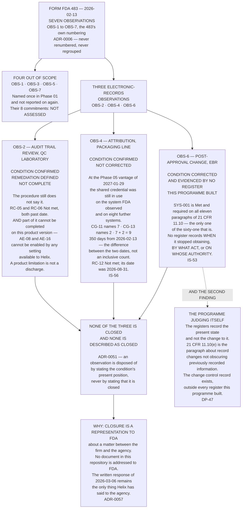

# Diagram — The Three Dispositions, and Not One of Them Is Closure

| Field | Value |
|---|---|
| Version | 1.0 |
| Date | 2027-04-09 |
| Owner | Terrence Abbatiello, Head of Quality Assurance |
| Approver | Dr Marguerite Oyelaran, Vice President, Quality |
| Classification | Confidential — Helix Pharma, Inc. Data Integrity Programme // Illustrative Portfolio Sample |

*Phase 08 speaks as at **2027-04-09**. Helix Pharma and every figure drawn here are fictional and illustrative. **21 CFR Part 11 and 21 CFR Part 211 are real** and are cited in the chapters that own each step.*

---

**What this diagram shows.** It shows the three inspectional observations this programme took, and the
three different positions the programme has stated about them. **`OBS-2` — the condition is confirmed, the
remediation is defined, and it is not complete**, and part of what remains owed cannot be completed on the
current product version because two auditable event classes cannot be enabled by any setting available to
Helix. **`OBS-4` — the condition is confirmed and it is not corrected**: at the Phase 05 vantage the shared
credential was still in use on the system observed and on eight further systems. **`OBS-6` — the condition
is corrected, and the correction is evidenced by no register this programme built.** **The three are drawn
side by side because their differences are the point: they are in three genuinely different positions, and
no single word fits all three.** The positions are argued at `../08.05-obs-2.md`, `../08.06-obs-4.md` and
`../08.07-obs-6-and-the-register-that-cannot-show-it.md`, and every figure drawn here is computed in
`../logs/commitment-register.md` or read off a Phase 05 register.

**What this diagram does not show.** **It does not show a closure, a percentage of completion, a status, a
maturity level or a direction of travel.** There is no arrow on this chart that means *progress*, and the
three boxes are not stages of one process. **A reader who ranks them has invented an ordering the programme
refused** — `PR-57`.

**It does not show a remediation plan.** No box carries a date, an owner of a future act, a sequence, a
priority or a cost. **What remains owed under `OBS-2` is listed at `../08.05-obs-2.md §3` against entries
that already existed**, and **nothing in this phase created a plan, a schedule or a CAPA.**

**It says nothing about the four out-of-scope observations beyond the fact that they exist and are not
reported on.** The box that names them names them once, which is exactly what
`../../01-program-foundation-and-regulatory-scoping/01.02-the-inspection-and-the-form-483.md §3` did — and
**a data integrity programme that annexed them at its eighth phase would be claiming work it has not
done.**

**`OBS-6`'s box is not a statement about the estate.** **`SYS-001` is one system.** The second proposition
of the observation — a change not visible in the record presented for review — **is a class the estate
still carries at `CG-15`, on six systems**, and `PR-61` carries the risk that the corrected position on one
system is read as the class being closed. **`ADR-0006`'s refusal to split the observation into its two
propositions is what keeps both on the chart.**

**`OBS-4`'s box states no legal conclusion.** **A shared account does not fail `21 CFR 11.10(d)` on its
face and does not make a system open**; what it defeats is attribution, which is `21 CFR 211.188(b)(11)`
and `21 CFR 211.194(a)(7)`. **Nothing on this chart characterises any condition as a violation, a breach or
a non-compliance**, and **the nine positions it counts are Phase 05's, re-determined nowhere.**

**And it forecasts nothing.** **There has been no further inspection and there is no inspection outcome of
any kind.** **No box on this chart says what any future inspection will find, and no document in this
repository does.**

## Cross-References

| Document | Relationship |
|---|---|
| [08.01 What a Disposition Is](../08.01-what-a-disposition-is.md) | **Owns disposition against closure** — `ADR-0051` |
| [08.05 `OBS-2`](../08.05-obs-2.md) | **Owns the first position** |
| [08.06 `OBS-4`](../08.06-obs-4.md) | **Owns the second position** — `IS-56` |
| [08.07 `OBS-6` and the Register That Cannot Show It](../08.07-obs-6-and-the-register-that-cannot-show-it.md) | **Owns the third position and the second finding** — `IS-53` |
| [logs/commitment-register.md](../logs/commitment-register.md) | The commitment positions drawn on each box |
| [governance/GOV-38](../governance/GOV-38-the-three-dispositions-accepted.md) | The sitting that accepted all three |
| [01.02 The Inspection and the Form FDA 483](../../01-program-foundation-and-regulatory-scoping/01.02-the-inspection-and-the-form-483.md) | **`§3` and `§4` — the seven, and the three in the programme's own words** |
| [05 control-position-register.md](../../05-access-audit-trails-and-electronic-signatures/logs/control-position-register.md) | `SYS-001`'s eleven, and the `(d)` column |

---

← [Phase 08 README](../08.00-README.md) · [diagrams/08-twenty-two-to-fourteen-to-six.md](08-twenty-two-to-fourteen-to-six.md) →
