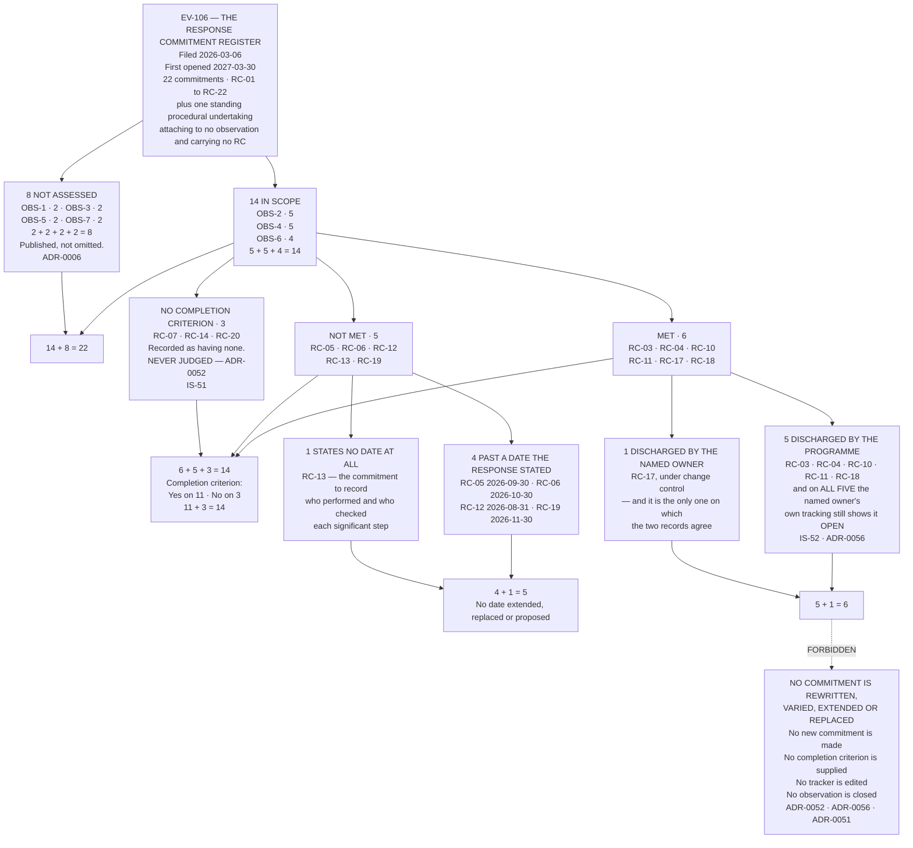

# Diagram — Twenty-Two to Fourteen to Six, and Then Six to Five

| Field | Value |
|---|---|
| Version | 1.0 |
| Date | 2027-04-09 |
| Owner | Rebekah Sandquist, Head of Regulatory Affairs |
| Approver | Terrence Abbatiello, Head of Quality Assurance |
| Classification | Confidential — Helix Pharma, Inc. Data Integrity Programme // Illustrative Portfolio Sample |

*Phase 08 speaks as at **2027-04-09**. Helix Pharma and every figure drawn here are fictional and illustrative. **21 CFR Part 11 and 21 CFR Part 211 are real** and are cited in the chapters that own each step.*

---

**What this diagram shows.** It shows the commitments the written response of 2026-03-06 made, as they come
out when they are read against their own words. **Twenty-two commitments, `RC-01` to `RC-22`. Fourteen
attach to `OBS-2`, `OBS-4` or `OBS-6` and are assessed; eight attach to the other four observations and are
not. 14 + 8 = 22.** **Of the fourteen: Met 6 · Not met 5 · No completion criterion 3. 6 + 5 + 3 = 14.** The
five not met split **4 past a date the response stated and 1 stating no date at all, 4 + 1 = 5**; the six
met split **5 discharged by this programme and 1 by the individual the response named, 5 + 1 = 6** — and on
each of the five the owner's own tracking still shows the commitment open. **Every count drawn here is
computed from the rows of `../logs/commitment-register.md` and reconciled at `EV-811`.**

**What this diagram does not show.** **It does not show a disposition of any observation.** Six commitments
met is not an observation disposed of, and the fourteen do not add up to a position on anything: **`OBS-2`'s
position depends on a product limitation no commitment mentions, `OBS-4`'s on nine systems no commitment
enumerates, and `OBS-6`'s on a determination made in Phase 05 against a paragraph no commitment cites.**
The three positions are at `../08.05-obs-2.md`, `../08.06-obs-4.md` and
`../08.07-obs-6-and-the-register-that-cannot-show-it.md`.

**It does not show progress.** The *Met* box is not further along than the *Not met* box. **Four of the six
met are commitments to establish, determine, identify or record something — that is, commitments to find
out** — and finding out is not correcting. `RC-10` identified nine systems on which a credential is shared;
`RC-12`, which would have withdrawn them, is in the box next to it.

**It does not grade the three with no completion criterion.** They are not met, they are not unmet, and
**the diagram deliberately gives them a box of their own rather than a shading of one of the other two.**
Writing a test for them now would be assessing Helix against a commitment Helix never filed — `ADR-0052`,
`PR-59`.

**It says nothing about any individual.** **The five-of-six box is about two records, not about five
people.** Nobody failed to do anything they were asked to do; the work was done, and it was done by the
programme. `PR-60` carries the misreading, and `../08.04-who-actually-did-it.md` states the refusal before
it states the finding.

**And it is not a communication to anybody.** **`EV-106` stands exactly as filed on 2026-03-06.** **Nothing
on this chart has been sent, offered or shown to FDA**, no figure on it amends the response, and **the
response of 2026-03-06 remains the only thing Helix has said to the agency about any of this** — `PR-58`.

## Cross-References

| Document | Relationship |
|---|---|
| [08.03 The Commitments](../08.03-the-commitments.md) | **Owns the 22, the 14 and the 8, and the 6 / 5 / 3** — `IS-51` |
| [08.04 Who Actually Did It](../08.04-who-actually-did-it.md) | **Owns the 5-of-6** — `IS-52` |
| [08.02 Reading a Commitment Against Its Own Words](../08.02-reading-a-commitment-against-its-own-words.md) | **Owns the method** — `ADR-0052`, `ADR-0056` |
| [logs/commitment-register.md](../logs/commitment-register.md) | **`RC-01` to `RC-22`, and every count drawn here** |
| [governance/GOV-37](../governance/GOV-37-the-commitment-assessment-accepted.md) | The sitting that accepted the assessment |
| [logs/evidence-index.md](../logs/evidence-index.md) | `EV-806` to `EV-812` |
| [01 GOV-03](../../01-program-foundation-and-regulatory-scoping/governance/GOV-03-form-fda-483-response-review-and-release.md) | The review and release of the response, and `EV-106` |

---

← [diagrams/08-the-three-dispositions.md](08-the-three-dispositions.md) · [Phase 08 README](../08.00-README.md) · [diagrams/08-the-review-frequencies.md](08-the-review-frequencies.md) →
